1. **TCP三次握手四次挥手**

   三次握手：

   

   第一次握手：客户端的应用进程主动打开，并向服务端发出请求报文段。其首部中：SYN=1,seq=x。
   第二次握手：服务器应用进程被动打开。若同意客户端的请求，则发回确认报文，其首部中：SYN=1,ACK=1,ack=x+1,seq=y。

   第三次握手：客户端收到确认报文之后，通知上层应用进程连接已建立，并向服务器发出确认报文，其首部：ACK=1,ack=y+1。当服务器收到客户端的确认报文之后，也通知其上层应用进程连接已建立。

   四次挥手：

   

   第一次挥手：数据传输结束以后，客户端的应用进程发出连接释放报文段，并停止发送数据，其首部：FIN=1,seq=u。
   第二次挥手：服务器端收到连接释放报文段之后，发出确认报文，其首部：ACK=1,ack=u+1,seq=v。此时本次连接就进入了半关闭状态，客户端不再向服务器发送数据。而服务器端仍会继续发送。
   第三次挥手：若服务器已经没有要向客户端发送的数据，其应用进程就通知服务器释放TCP连接。这个阶段服务器所发出的最后一个报文的首部应为：FIN=1,ACK=1,seq=w,ack=u+1。

   第四次挥手：客户端收到连接释放报文段之后，必须发出确认：ACK=1,seq=u+1,ack=w+1。 再经过2MSL(最长报文端寿命)后，本次TCP连接真正结束，通信双方完成了他们的告别。

2. **序列号是怎么算出来的**

   TCP握手采用随机序列号（**不完全随机，而是随着时间流逝而线性增长，到了2^32尽头再回滚**）

   ```
   ISN = M + F(localhost, localport, remotehost, remoteport)
   ```

   M是一个计时器，每隔4毫秒加1。 F是一个Hash算法，根据源IP、目的IP、源端口、目的端口生成一个随机数值。要保证hash算法不能被外部轻易推算得出。

3. **第二次握手的syn和ack能分开吗？**

   不可以。总结了几方面原因：一是为了提高传输效率，没必要把三次拆成四次；二是拆成四次会增加传输失败的概率，影响连接的建立；三应该是和每次请求的seq序列号和ack确认号有关系，TCP 需要 seq 序列号来做可靠重传或接收，而避免连接复用时无法分辨出 seq 是延迟或者是旧链接的 seq。接收方接收到第一个 SYN 时，没有办法知道这个 SYN 是是否延迟了很久了，除非他有办法记住在这条连接中，最后接收到的那个sequence numbers，因此，接收方一定要对传输方发送syn，如果只传ack没有syn的话，就会出现无法分辨出seq是延迟或者是旧链接的seq。而如果先传输syn后传输ack的话，就需要产生额外的确认。

4. **如果不进行第三次握手会有什么后果**

   不进行第三次握手的话，服务端无法收到ack，tcp连接无法正常建立。如果恶意的向某个服务器端口发送大量的SYN包，不进行第三次握手，这就是syn flood攻击，服务器会打开大量的半开连接，分配TCB（Transmission Control Block）, 从而消耗大量的服务器资源，同时也使得正常的连接请求无法被响应。

   攻击防范方法：

   1. 无效连接的监视释放
   2. 延缓TCB分配方法
      1. syn cache技术
      2. syn cookie技术
   3. 使用syn proxy防火墙

5. **第三次握手失败会有什么后果**

   当Client端收到Server的SYN+ACK应答后，其状态变为ESTABLISHED，并发送ACK包给Server；

   如果此时ACK在网络中丢失，那么Server端该TCP连接的状态为SYN_RECV，并且依次等待3秒、6秒、12秒后重新发送SYN+ACK包，以便Client重新发送ACK包，以便Client重新发送ACK包。

   Server重发SYN+ACK包的次数，可以通过设置/proc/sys/net/ipv4/tcp_synack_retries修改，默认值为5。

   如果重发指定次数后，仍然未收到ACK应答，那么一段时间后，Server自动关闭这个连接。

   但是Client认为这个连接已经建立，如果Client端向Server写数据，Server端将以RST包响应，方能感知到Server的错误。

6. **四次挥手第二次和第三次能合并吗**

   不可以。 server 端TCP 接收到FIN=1 断开连接请求，需要发消息给application，**消息内容：对方要断开连接，请问您老人家还有数据要发送吗？**如果有数据请告知，没有数据也请告知！然后就是等待application 的回应。因此就直接把对client FIN的ack发出去。

   在第四次挥手时，如果server端还有数据需要发送，则一直等到数据发送完毕，然后application发送close消息给TCP，现在可以关闭连接，然后Server TCP 发FIN=1 断开 server -->client方向的连接。

   如果 server端没有数据发送，application回应close消息给TCP，现在可以关闭连接，然后Server TCP 发FIN=1 断开 server -->client方向的连接。

7. **time-wait和close-wait在客户端还是服务端**

   三次握手：

   client状态：SYN-SENT，ESTABLISHED

   server状态：SYN-RCVD，ESTABLISHED

   四次挥手：

   client状态：FIN-WAIT-1，FIN-WAIT-2，TIME-WAIT，CLOSED

   server状态：CLOSE-WAIT，LAST-ACK

8. **select、poll和epoll之间的区别**

   select: select 允许应用程序监视一组文件描述符，等待一个或者多个描述符成为就绪状态，从而完成I/O操作。它仅仅知道了，有I/O事件发生了，却并不知道是哪那几个流（可能有一个，多个，甚至全部），我们只能无差别轮询所有流，找出能读出数据，或者写入数据的流，对他们进行操作。所以select具有O(n)的无差别轮询复杂度，同时处理的流越多，无差别轮询时间就越长。

   poll: poll本质上和select没有区别，它将用户传入的数组拷贝到内核空间，然后查询每个fd对应的设备状态，但是它没有最大连接数的限制，原因是它是基于链表来存储的。

   1. 功能

      select 和 poll 的功能基本相同，不过在一些实现细节上有所不同。

      - select 会修改描述符，而 poll 不会；
      - select 的描述符类型使用数组实现，FD_SETSIZE 大小默认为 1024，因此默认只能监听 1024 个描述符。如果要监听更多描述符的话，需要修改 FD_SETSIZE 之后重新编译；而 poll 没有描述符数量的限制；
      - poll 提供了更多的事件类型，并且对描述符的重复利用上比 select 高。
      - 如果一个线程对某个描述符调用了 select 或者 poll，另一个线程关闭了该描述符，会导致调用结果不确定。

   2. 速度

      select 和 poll 速度都比较慢，每次调用都需要将全部描述符从应用进程缓冲区复制到内核缓冲区。

   3. 可移植性

      几乎所有的系统都支持 select，但是只有比较新的系统支持 poll。

   epoll: epoll可以理解为event poll，不同于忙轮询和无差别轮询，epoll会把哪个流发生了怎样的I/O事件通知我们。所以我们说epoll实际上是事件驱动（每个事件关联上fd）的，此时我们对这些流的操作都是有意义的。（复杂度降低到了O(1)）

   **epoll事先通过epoll_ctl()来注册一 个文件描述符，一旦基于某个文件描述符就绪时，内核会采用类似callback的回调机制，迅速激活这个文件描述符，将文件描述符放入就绪队列中，epoll_wait的工作实际上就是在这个就绪队列中查看有没有就绪的fd，当进程调用epoll_wait() 时便得到通知**。(`此处去掉了遍历文件描述符，而是通过监听回调的的机制`。这正是epoll的魅力所在。)

   epoll没有最大连接的限制，它所支持的FD上限是最大可以打开文件的数目，这个数字一般远大于2048，一般来说这个数目和系统内存关系很大。

   epoll有EPOLLLT和EPOLLET两种触发模式，LT是默认的模式，ET是“高速”模式。LT模式下，只要这个fd还有数据可读，每次epoll_wait都会返回它的事件，提醒用户程序去操作，而在ET（边缘触发）模式中，它只会提示一次，直到下次再有数据流入之前都不会再提示了，无论fd中是否还有数据可读。

   ET模式在很大程度上减少了epoll事件被重复触发的次数，因此效率要比LT模式高。epoll工作在ET模式的时候，必须使用非阻塞套接口，以避免由于一个文件句柄的阻塞读/阻塞写操作把处理多个文件描述符的任务饿死。

   每一次调用 select( )和poll( ) 都需要先从 user space把fd set复制到 kernel（约线性时间成本），epoll在用epoll_ctl函数进行事件注册的时候，已经将fd复制到内核中，不需要每次都从user space 将fd set复制到内核kernel。

   epoll是Linux所特有，而select则应该是POSIX所规定，一般操作系统均有实现。

9. **进程和线程的区别**

   Ⅰ 拥有资源

   进程是资源分配的基本单位，但是线程不拥有资源，线程可以访问隶属进程的资源。

   Ⅱ 调度

   线程是独立调度的基本单位，在同一进程中，线程的切换不会引起进程切换，从一个进程中的线程切换到另一个进程中的线程时，会引起进程切换。

   Ⅲ 系统开销

   由于创建或撤销进程时，系统都要为之分配或回收资源，如内存空间、I/O 设备等，所付出的开销远大于创建或撤销线程时的开销。类似地，在进行进程切换时，涉及当前执行进程 CPU 环境的保存及新调度进程 CPU 环境的设置，而线程切换时只需保存和设置少量寄存器内容，开销很小。

   Ⅳ 通信方面

   线程间可以通过直接读写同一进程中的数据进行通信，但是进程通信需要借助 IPC。

10. **并发和并行的区别**

    并发：一个处理器同时处理多个任务，并不需要同一时间发生。

    并行：多个处理器或者是多核的处理器同时做多个不同的任务。

    并行是指两个或者多个事件在同一时刻发生，并发是指多个事件在同一时间段内发生

11. **进程间怎么通信的**

    每个进程各自有不同的用户地址空间,任何一个进程的全局变量在另一个进程中都看不到，所以进程之间要交换数据必须通过内核,在内核中开辟一块缓冲区,进程A把数据从用户空间拷到内核缓冲区,进程B再从内核缓冲区把数据读走,内核提供的这种机制称为进程间通信。

    1. 匿名管道通信

       管道是一种半双工的通信方式，数据只能**单向流动**，而且只能在具有亲缘关系的进程间使用。进程的亲缘关系通常是指**父子进程关系**。

    2. 高级管道通信

       将另一个程序当做一个新的进程在当前程序进程中启动，则它算是当前程序的子进程，这种方式我们成为高级管道方式。

    3. 有名管道通信

       有名管道也是半双工的通信方式，但是它允许无亲缘关系进程间的通信。

    4. 消息队列通信

       消息队列是由消息的链表，存放在内核中并由消息队列标识符标识。消息队列克服了信号传递信息少、管道只能承载无格式字节流以及缓冲区大小受限等缺点。

    5. 信号量通信

       信号量是一个计数器，可以用来控制多个进程对共享资源的访问。它常作为一种锁机制，防止某进程正在访问共享资源时，其他进程也访问该资源。因此，主要作为进程间以及同一进程内不同线程之间的同步手段。

    6. 信号

       信号是一种比较复杂的通信方式，用于通知接收进程某个事件已经发生。

    7. 共享内存通信

       共享内存就是映射一段能被其他进程所访问的内存，这段共享内存由一个进程创建，但多个进程都可以访问。共享内存是最快的 IPC 方式，它是针对其他进程间通信方式运行效率低而专门设计的。它往往与其他通信机制，如信号量，配合使用，来实现进程间的同步和通信。

    8. 套接字通信

       套接口也是一种进程间通信机制，与其他通信机制不同的是，它可用于不同机器间的进程通信。

12. **有两个包含10亿数字的大文件，怎么找出两个文件同时出现的数字**

    利用bitmap进行映射，将10亿个数字映射到一个10亿位的数字上，10亿个数字占用的空间为1000000000 * 4 / 1024 / 1024 / 1024 = 3.73G，使用bitmap后，10亿个数字占用的空间为1000000000 / 8 / 1024 / 1024 = 116M，极大地减小了内存占用。将两个文件中的所有数字利用bitmap映射到两个变量上，然后对两个变量进行与运算，就能得到两个文件中同时出现的数字。

13. **海量数据文件处理方法总结**

    1. 分而治之/hash映射 + hashmap统计 + 堆/快速/归并排序

       一般情况下，海量数据文件都能使用hash映射的方法，即先进行hash然后取模，将数据分到不同的数据文件中，经过这种划分之后，相同数字或字符串只会存在于同一个文件中，不同文件中不会存在相同数据。然后就可以利用hashmap统计出现频率或者利用堆排序或其他排序算法等得到想要的结果。

       hash映射适用于一些对数字文件的处理，堆排序适用于筛选top K类型的问题。

    2. 多层划分

       适用范围：第k大，中位数，不重复或重复的数字
       基本原理及要点：因为元素范围很大，不能利用直接寻址表，所以通过多次划分，逐步确定范围，然后最后在一个可以接受的范围内进行。

    3. bloom filter/bitmap

       可以用来实现数据字典，进行数据的判重，或者集合求交集。bitmap比较适合于判断两个数字文件之间的交集，不太擅长处理数据出现多次的情况。如果是判断重复的问题，可以考虑以2bit存一个数或者使用两个bitmap。

    4. trie树/数据库/倒排索引

       trie树：

       - 适用范围：数据量大，重复多，但是数据种类小可以放入内存
       - 基本原理及要点：实现方式，节点孩子的表示方式
       - 扩展：压缩实现。

       数据库索引：

       - 适用范围：大数据量的增删改查
       - 基本原理及要点：利用数据的设计实现方法，对海量数据的增删改查进行处理。

       倒排索引：

       - 适用范围：搜索引擎，关键字查询

14. **linux五种I/O模型**

    - 阻塞式I/O

      - **在IO执行的两个阶段中，进程都处于blocked(阻塞)状态，在等待数据返回的过程中不能做其他的工作，只能阻塞的等在那里。**

      - 优点是简单，实时性高，响应及时无延时，但缺点也很明显，需要阻塞等待，性能差；

    - 非阻塞式I/O

      - **在非阻塞状态下，IO执行的等待阶段并不是完全的阻塞的，但是第二个阶段依然处于一个阻塞状态。** 
      - **优点**：能够在等待任务完成的时间里干其他活了（包括提交其他任务，也就是 “后台” 可以有多个任务在同时执行）。 
      - **缺点**：任务完成的响应延迟增大了，因为每过一段时间才去轮询一次read操作，而任务可能在两次轮询之间的任意时间完成。这会导致整体数据吞吐量的降低。

    - I/O复用（select、poll和epoll等）

      - 如果处理的连接数不是很高的话，使用IO复用的服务器并不一定比使用多线程+非阻塞 IO的性能更好，可能延迟还更大。IO复用的优势并不是对于单个连接能处理得更快，而是单个进程就可以同时处理多个网络连接的IO。 
      - **优势：**与传统的多线程/多进程模型比，I/O多路复用的最大优势是系统开销小，系统不需要创建新的额外进程或者线程，也不需要维护这些进程和线程的运行，降底了系统的维护工作量，节省了系统资源。 

    - 信号驱动式I/O（SIGIO）

      - 允许Socket进行信号驱动IO,并注册一个信号处理函数，进程继续运行并不阻塞。当数据准备好时，进程会收到一个SIGIO信号，可以在信号处理函数中调用I/O操作函数处理数据。
      - **阻塞在IO操作的第二阶段**

    - 异步I/O（POSIX的aio_系列函数）

      - **IO两个阶段，进程都是非阻塞的**。

    前四种I/O模型都是同步I/O操作，他们的区别在于第一阶段，而他们的第二阶段是一样的：在数据从内核复制到应用缓冲区期间（用户空间），进程阻塞于recvfrom调用。相反，异步I/O模型在这等待数据和接收数据的这两个阶段里面都是非阻塞的，可以处理其他的逻辑用户进程将整个IO操作交由内核完成，内核完成后会发送通知。在此期间，用户进程不需要去检查IO操作的状态，也不需要主动的去拷贝数据。

15. **ThreadLocal深度解析**

    - ThreadLocal是什么？

      ThreadLocal是一个本地线程副本变量工具类。主要用于将私有线程和该线程存放的副本对象做一个映射，各个线程之间的变量互不干扰，在高并发场景下，可以实现无状态的调用，特别适用于各个线程依赖不通的变量值完成操作的场景。

      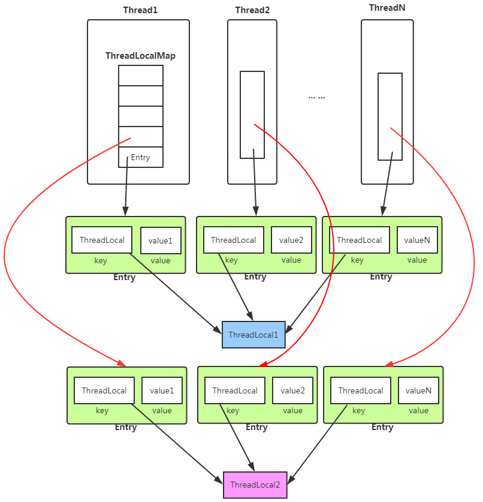

      - 每个Thread线程内部都有一个ThreadLocalMap。
      - ThreadLocalMap里面存储Entry对象，每个Entry对象是由线程本地对象（key）和线程的变量副本（value）的键值对组成的
      - 但是，Thread内部的Map是由ThreadLocal维护的，由ThreadLocal负责向map获取和设置线程的变量值。而ThreadLocal本身并不存储数据，相当于标识符，作为Entry的key值，因此对不同的线程来说，每次获取副本值时，别的线程并不能获取到当前线程的副本值，形成了副本的隔离，互不干扰。

    - ThreadLocalMap

      - ThreadLocalMap是ThreadLocal的内部类，没有实现Map接口，用独立的方式实现了Map的功能，其内部的Entry也独立实现。这样的话容易出现hash冲突，ThreadLocalMap中解决Hash冲突的方式并非链表的方式，而是采用线性探测的方式，所谓线性探测，就是根据初始key的hashcode值确定元素在table数组中的位置，如果发现这个位置上已经有其他key值的元素被占用，则利用固定的算法寻找一定步长的下个位置，依次判断，直至找到能够存放的位置。
      - ThreadLocalMap解决Hash冲突的方式就是简单的步长加1或减1，寻找下一个相邻的位置。
      - **所以这里引出的良好建议是：每个线程只存一个变量，这样的话所有的线程存放到map中的Key都是相同的ThreadLocal，如果一个线程要保存多个变量，就需要创建多个ThreadLocal，多个ThreadLocal放入Map中时会极大的增加Hash冲突的可能。**

      - 在ThreadLocalMap中，也是用Entry来保存K-V结构数据的。但是Entry中key只能是ThreadLocal对象，这点被Entry的构造方法已经限定死了。Entry继承自WeakReference（弱引用，生命周期只能存活到下次GC前），但只有Key是弱引用类型的，Value并非弱引用。ThreadLocal在没有外部对象强引用时，发生GC时弱引用Key会被回收，而Value不会回收，如果创建ThreadLocal的线程一直持续运行，那么这个Entry对象中的value就有可能一直得不到回收，发生内存泄露。
      - 既然Key是弱引用，那么我们要做的事，就是在调用ThreadLocal的get()、set()方法时完成后再调用remove方法，将Entry节点和Map的引用关系移除，这样整个Entry对象在GC Roots分析后就变成不可达了，下次GC的时候就可以被回收。

16. **线程池原理**

    - Java中的ThreadPoolExecutor类
      - ThreadPoolExecutor类中的核心参数：
        - corePoolSize：核心池大小
        - maximumPoolSize：线程池最大线程数
        - keepAliveTime：表示线程没有任务执行时最多保持多久时间会终止
        - unit：参数keepAliveTime的时间单位
        - workQueue：阻塞队列，一般有以下几种选择：
          - ArrayBlockingQueue
          - LinkedBlockingQueue
          - SynchronousQueue
        - threadFactory：线程工厂，主要用来创建线程
        - handler：表示当拒绝处理任务时的策略，有以下四种取值：
          - ThreadPoolExecutor.AbortPolicy:丢弃任务并抛出RejectedExecutionException异常
          - ThreadPoolExecutor.DiscardPolicy：也是丢弃任务，但是不抛出异常。
          - ThreadPoolExecutor.DiscardOldestPolicy：丢弃队列最前面的任务，然后重新尝试执行任务（重复此过程）
          - ThreadPoolExecutor.CallerRunsPolicy：由调用线程处理该任务 
      - ThreadPoolExecutor类继承自AbstractExecutorService类，AbstractExecutorService类实现了ExecutorService接口，ExecutorService继承自Executor接口。
      - Executor接口声明了execute方法，ExecutorService接口声明了submit、invokeAll、invokeAny以及shutDown等方法，抽象类AbstractExecutorService实现了ExecutorService接口，基本实现了ExecutorService中声明的所有方法；ThreadPoolExecutor继承了类AbstractExecutorService，有几个比较重要的方法：execute( )，submit( )，shutdown( )，shutdownNow( )。
      
    - 线程池实现原理
      - JDK1.7原理介绍看这篇：https://www.cnblogs.com/dolphin0520/p/3932921.html
      - JDK1.8原理介绍看这两篇：https://blog.csdn.net/youxitongyongming/article/details/77751874和https://blog.csdn.net/youxitongyongming/article/details/77774029
      - execute方法实现原理：首先判断当前线程数是否小于核心池数目，如果是的话，直接添加新的线程；否则，判断线程池是否处于运行状态并且能够将任务成功添加到工作队列，添加新线程失败同样要进行此判断，如果这个判断失败，说明工作队列已满，继续尝试添加新的线程，此时，线程池中线程数大于核心池数量小于最大线程数量；如果添加失败，说明此时线程池线程数量大于最大线程数，拒绝此任务；如果线程池处于运行状态并且将任务成功添加到工作队列，然后为保证线程安全，判断线程池是否不处于运行状态，并且把任务从工作队列中删除成功，如果是的话，拒绝此任务；如果条件不成立的话，判断当前线程数是否为0，如果不为0，直接结束，否则的话，添加一个新线程，结束。
      
    - 使用线程池的好处
      - 降低资源消耗：可以重复利用已创建的线程降低线程创建和销毁造成的消耗。
      - 提高响应速度：当任务到达时，任务可以不需要等到线程创建就能立即执行。
      - 提高线程的可管理性：线程是稀缺资源，如果无限制地创建，不仅会消耗系统资源，还会降低系统的稳定性，使用线程池可以进行统一分配、调优和监控
      
    - 使用线程池的注意事项

      - 死锁

        任何多线程程序都有死锁的风险，最简单的情形是两个线程AB，A持有锁1，请求锁2，B持有锁2，请求锁1。（这种情况在mysql的排他锁也会出现，不会数据库会直接报错提示）。线程池中还有另一种死锁：假设线程池中的所有工作线程都在执行各自任务时被阻塞，它们在等待某个任务A的执行结果。而任务A却处于队列中，由于没有空闲线程，一直无法得以执行。这样线程池的所有资源将一直阻塞下去，死锁也就产生了。

      - 系统资源不足

        如果线程池中的线程数目非常多，这些线程会消耗包括内存和其他系统资源在内的大量资源，从而严重影响系统性能。

      - 并发错误

        线程池的工作队列依靠wait()和notify()方法来使工作线程及时取得任务，但这两个方法难以使用。如果代码错误，可能会丢失通知，导致工作线程一直保持空闲的状态，无视工作队列中需要处理的任务。因为最好使用一些比较成熟的线程池。

      - 线程泄露

        使用线程池的一个严重风险是线程泄漏。对于工作线程数目固定的线程池，如果工作线程在执行任务时抛出RuntimeException或Error，并且这些异常或错误没有被捕获，那么这个工作线程就异常终止，使线程池永久丢失了一个线程。（这一点太有意思）

        另一种情况是，工作线程在执行一个任务时被阻塞，如果等待用户的输入数据，但是用户一直不输入数据，导致这个线程一直被阻塞。这样的工作线程名存实亡，它实际上不执行任何任务了。如果线程池中的所有线程都处于这样的状态，那么线程池就无法加入新的任务了。

      - 任务过载

        当工作线程队列中有大量排队等待执行的任务时，这些任务本身可能会消耗太多的系统资源和引起资源缺乏。

    - 使用线程池遵循的原则：

      - 如果任务A在执行过程中需要同步等待任务B的执行结果，那么任务A不适合加入到线程池的工作队列中。如果把像任务A一样的需要等待其他任务执行结果的加入到队列中，可能造成死锁。

      - 如果执行某个任务时可能会阻塞，并且是长时间的阻塞，则应该设定超时时间，避免工作线程永久的阻塞下去而导致线程泄漏。在服务器才程序中，当线程等待客户连接，或者等待客户发送的数据时，都可能造成阻塞，可以通过以下方式设置时间：

        调用ServerSocket的setSotimeout方法，设定等待客户连接的超时时间。

        对于每个与客户连接的socket，调用该socket的setSoTImeout方法，设定等待客户发送数据的超时时间。

      - **了解任务的特点**，分析任务是执行经常会阻塞io操作，还是执行一直不会阻塞的运算操作。前者时断时续的占用cpu，而后者具有更高的利用率。预计完成任务大概需要多长时间，是短时间任务还是长时间任务，然后根据任务的特点，对任务进行分类，然后把不同类型的任务加入到不同的线程池的工作队列中，这样就可以根据任务的特点，分配调整每个线程池。

      - **调整线程池的大小**。线程池的最佳大小主要取决于系统的可用cpu的数目，以及工作队列中任务的特点。假如一个具有N个cpu的系统上只有一个工作队列，并且其中全部是运算性质(不会阻塞)的任务，那么当线程池拥有N或N+1个工作线程时，一般会获得最大的cpu使用率。如果工作队列中包含会执行IO操作并经常阻塞的任务，则要让线程池的大小超过可用 cpu的数量，因为并不是所有的工作线程都一直在工作。选择一个典型的任务，然后估计在执行这个任务的工程中，等待时间与实际占用cpu进行运算的时间的比例WT/ST。对于一个具有N个cpu的系统，需要设置大约N*(1+WT/ST)个线程来保证cpu得到充分利用。

        当然,cpu利用率不是调整线程池过程中唯一要考虑的事项，随着线程池工作数目的增长，还会碰到内存或者其他资源的限制，如套接字，打开的文件句柄或数据库连接数目等。要保证多线程消耗的系统资源在系统承受的范围之内。

      - **避免任务过载**。服务器应根据系统的承载能力，限制客户并发连接的数目。当客户的连接超过了限制值，服务器可以拒绝连接，并进行友好提示，或者限制队列长度。

17. **简单工厂、工厂方法和抽象工厂比较**

    - 简单工厂
      - 优点
        - 不需要关心类的实现细节
        - 简单工厂实现了对象的创建和使用的分离
      - 缺点
        - 工厂类的职责过重
        - 违背了开闭原则，扩展复杂
    - 工厂方法
      - 优点
        - 一个工厂对应一个产品，创建对象的细节封装在具体工厂内部，体现了多态性
        - 增加产品只需要增加对应的工厂，符合开闭原则
      - 缺点
        - 对某些可以形成产品族的情况比较复杂
    - 抽象工厂
      - 优点
        - 针对产品族比较方便
      - 缺点
        - 在增加产品的时候，违反了开闭原则

    简单工厂 ： 用来生产同一等级结构中的任意产品。（不支持拓展增加产品）

    工厂方法 ：用来生产同一等级结构中的固定产品。（支持拓展增加产品）   

    抽象工厂 ：用来生产不同产品族的全部产品。（不支持拓展增加产品；支持增加产品族）  

18. **ClassLoader和Class.forName( )的比较**

    1. ClassLoader是将类的.class文件加载到jvm中，不会执行static内容，只有在newInstance时才会执行static块。
    2. Class.forName( )不仅是将类的.class文件加载到jvm中，还会对类进行解释，执行static内容。

19. **java进行数据库连接时为什么要写Class.forName("xxx")**

    1. JDBC是桥接模式的典型应用，Class.forName(String className)的作用有两个，一个是将CLASSPATH下指定名字的.class文件加载到jvm中，第二个是初始化这个类。
    2. Class.forName("com.mysql.jdbc.Driver")的作用实际上就是调用DriverManager的registerDriver方法注册一个mysql的JDBC驱动（Driver）而已，Driver继承NonRegisteringDriver.java，NonRegisteringDriver.java实现了JDK提供的Driver接口，这个Driver提供了若干数据库连接的方法，每个不同的数据库连接类都必须实现它，并重写和具体的数据库连接的算法。
    3. JDK不负责和数据库连接打交道，也没必要，只提供一个具体的接口Driver，告诉所有第三方，要连接数据库，就去实现这个接口，然后通过DriverManager注册一下，到时候连接某个数据库的时候，你已经在我这里注册了，我会调用你注册进来的Driver里面的方法去对指定数据库进行连接的。
    4. 我们仅仅需要初始化这个类，执行static块的内容就行了，不需要使用这个类内部的API，因此没必要对其进行实例化。

20. **PriorityQueue**

    1. PriorityQueue继承自类AbstractQueue，AbstractQueue继承了类AbstractCollection，实现了接口Queue，接口Queue中提供了队列的offer、add、remove和poll方法，AbstractCollection提供了集合类的一些通用方法，例如size、iterator等。
    2. PriorityQueue内部实现采用了数组的方式存储，是一个无界优先级队列，默认队列大小为11，当队列中元素数量超过当前size后，会自动进行扩容。本质上是一棵完全二叉树，因此直接打印队列时的输出顺序可能不是已经排好序的，但是如果一个一个poll出来的话已经是排好序的。
    3. PriorityQueue默认是一个最小堆的结构，队列顶端是当前队列中的最小值，在offer和poll时每进行一次操作就会重新调整整个树结构，在offer时，把元素添加到队尾，然后依次与父节点进行比较，调整堆结构；在poll时，把队首的元素出队列，然后把队尾的元素放到队首，调整堆结构。
    4. PriorityQueue是一种无界的，线程不安全的队列，存储的元素要求必须是可比较的对象， 如果不是就必须明确指定比较器。

21. **ArrayDeque**

    1. Deque 接口继承自 Queue接口，但 Deque 支持同时从两端添加或移除元素，因此又被成为双端队列。鉴于此，Deque 接口的实现可以被当作 FIFO队列使用，也可以当作LIFO队列（栈）来使用。官方也是推荐使用 Deque 的实现来替代 Stack。
    2. ArrayDeque 是 Deque 接口的一种具体实现，是依赖于可变数组来实现的。ArrayDeque 没有容量限制，可根据需求自动进行扩容。ArrayDeque不支持值为 null 的元素。
    3. 在 ArrayDeque 底部是使用数组存储元素，同时还使用了两个索引来表征当前数组的状态，分别是 head 和 tail。head 是头部元素的索引，但注意 tail *不是尾部元素的索引，而是尾部元素的下一位*，即下一个将要被加入的元素的索引。
    4. ArrayDeque默认容量是16，对数组的大小(即队列的容量)有特殊的要求，必须是 2^n。
    5. Deque采用循环数组，每增加一个对象，tail值就会+1 ，每移除一个对象，head值+1；通过 (tail = (tail + 1) & (elements.length - 1)) == head 来判断数组已满。
    6. 在每次添加元素后，如果头索引和尾部索引相遇，则说明数组空间已满，需要进行扩容操作。 ArrayDeque 每次扩容都会在原有的容量上翻倍，这也是对容量必须是2的幂次方的保证。

22. **Stack、ArrayDeque和LinkedList区别**

    1. 三者都是Collection的间接实现类，ArrayDeque实现Deque接口，Stack继承于Vector，LinkedList实现Deque与List接口。

    2. Stack底层是默认长度为10的数组，ArrayDeque底层是默认长度为16的数组，LinkedList底层是链表。

    3. 方法参照表

       | Stack   | ArrayDeque                | LinkedList                |
       | :------ | :------------------------ | :------------------------ |
       | push(e) | addFirst(e)/offerFirst(e) | addFirst(e)/offerFirst(e) |
       | pop()   | removeFirst()/pollFirst() | removeFirst()/pollFirst() |
       | peek()  | getFirst()/peekFirst()    | getFirst()/peekFirst()    |

    4. Stack是线程安全的，ArrayDeque和LinkedList都是线程不安全的。

    5. 通常情况下，不推荐使用Vector及其子类Stack，如果需要线程同步，使用Collections工具类中synchronizedXxx()将线程不同步的ArrayDeque以及LinkedList转换成线程同步。

    6. 频繁的插入、删除操作：LinkedList，频繁的随机访问操作：ArrayDeque，未知的初始数据量：LinkedLIst。

23. **==和equals**

    1. ==是比较运算符，当是基本数据类型时，比较的是变量的值，当是其他类型的对象时，用它比较的是两个对象的引用地址值是否相等
    2. equals是一个方法，如果对应的类没有重现Object类的equals()方法，则和==是一样的作用
    3. 我们通常关心的是对象值是否相当（一个值或者多个值），所以对象之间的比较一定要使用equals方法，而非==

24. **HashMap底层实现和原理**

    1. HashMap继承了AbstractHashMap类，实现了Map、Cloneable和Serializable接口，允许key值和value值为null，HashMap不能保证放入元素的顺序，它是无序的，和放入的顺序并不能相同。HashMap是线程不安全的。
    2. HashMap由数组和链表实现对数据的存储，采用Entry数组来存储key-value对，每一个键值对组成了一个Entry实体，Entry类实际上是一个单向的链表结构，它具有Next指针，可以连接下一个Entry实体，以此来解决Hash冲突的问题。数组中存储的是最后插入的元素。
    3. HashMap的push方法，首先判断table是否进行初始化，如果没有就先进行初始化，如果key == null，就放在Entry[]的0号位置，否则利用hash就计算在Entry[]上的存储位置，判断该位置上是否已经存在元素，如果是的话，就遍历该元素的单链表，判断key是否存在，如果存在，就更新value值，如果不存在，就调用addEntry方法，将key-value对生成Entry实体，添加到对应的Entry[]数组中。
    4. addEntry方法先判断当前容量是否超过阈值，如果超过的话，就进行两倍扩容，然后将数组中的元素重新计算index后放入扩容后的数组中，链表的顺序与之前的顺序相反。否则的话，就根据hash值算出新的Entry所在的位置，并将其插入链表的头部。
    5. get方法就是先计算出其hash值然后找出应该在table中的位置，然后遍历该位置上的链表，返回对应的value值。
    6. remove方法，先计算key的hash值找出应该在table中的位置，如果该位置上没有Entry，直接返回null，否则的话，遍历链表，定义了pre、e和next三个指针，如果pre和e相等表明链表只有一个元素，直接将table[i] = next = null 。若形成了pre -> e -> next 的连接关系，判断e的key是否和指定的key 相等，若相等则让pre -> next ,e 失去引用。

25. **HashMap和Hashtable的区别**

    1. hashtable是线程安全的，实现方法里面都添加了synchronized关键字来确保线程同步，HashMap是线程不安全的。多线程下使用HashMap一般建议使用Collections.synchronizedMap()方法。
    2. HashMap可以使用null作为key，而Hashtable则不允许null作为key
    3. HashMap是对Map接口的实现，HashTable实现了Map接口和Dictionary抽象类。
    4. HashMap的初始容量为16，Hashtable初始容量为11，两者的填充因子默认都是0.75。HashMap扩容时是当前容量翻倍即:capacity\*2，Hashtable扩容时是容量翻倍+1，即:capacity*2+1。
    5. Hashtable计算hash是直接使用key的hashcode对table数组的长度直接进行取模；HashMap计算hash对key的hashcode进行了二次hash，以获得更好的散列值，然后对table数组长度取摸。

26. **ConcurrentHashMap**

    1. JDK1.7版本

       - 在1.7版本中，ConcurrentHashMap使用了分段锁的机制，将数据分成一段一段的存储，然后给每一段数据配一把锁，当一个线程占用锁访问其中一个段数据的时候，其他段的数据也能被其他线程访问，能够实现真正的并发访问。
       - 初始时，ConcurrentHashMap一共有16个segment，每个segment都是一个类似HashMap的结构，即内部拥有一个Entry数组，数组中的每个元素又是一个链表；同时又是一个ReentrantLock（Segment继承了ReentrantLock）。
       - ConcurrentHashMap中的HashEntry相对于HashMap中的Entry有一定的差异性：HashEntry中的value以及next都被volatile修饰，这样在多线程读写过程中能够保持它们的可见性。
       - Segment下面包含很多个HashEntry列表数组。对于一个key，需要经过三次（为什么要hash三次下文会详细讲解）hash操作，才能最终定位这个元素的位置，这三次hash分别为：
         1. 对于一个key，先进行一次hash操作，得到hash值h1，也即h1 = hash1(key)；
         2. 将得到的h1的高几位进行第二次hash，得到hash值h2，也即h2 = hash2(h1高几位)，通过h2能够确定该元素的放在哪个Segment；
         3. 将得到的h1进行第三次hash，得到hash值h3，也即h3 = hash3(h1)，通过h3能够确定该元素放置在哪个HashEntry。
       - put操作：
         1. 判断value是否为null，如果为null，直接抛出异常。
         2. key通过一次hash运算得到一个hash值。
         3. 将得到hash值向右按位移动segmentShift位，然后再与segmentMask做&运算得到segment的索引j。
            在初始化的时候我们说过segmentShift的值等于32-sshift，例如concurrencyLevel等于16，则sshift等于4，则segmentShift为28。hash值是一个32位的整数，将其向右移动28位就变成这个样子：
            0000 0000 0000 0000 0000 0000 0000 xxxx，然后再用这个值与segmentMask做&运算，也就是取最后四位的值。这个值确定Segment的索引。
         4. 使用Unsafe的方式从Segment数组中获取该索引对应的Segment对象。
         5. 向这个Segment对象中put值，这个put操作也基本是一样的步骤（通过&运算获取HashEntry的索引，然后set）。
       - get操作：
         1. 和put操作一样，先通过key进行两次hash确定应该去哪个Segment中取数据。
         2. 使用Unsafe获取对应的Segment，然后再进行一次&运算得到HashEntry链表的位置，然后从链表头开始遍历整个链表（因为Hash可能会有碰撞，所以用一个链表保存），如果找到对应的key，则返回对应的value值，如果链表遍历完都没有找到对应的key，则说明Map中不包含该key，返回null。

    2. JDK1.8版本

       - 在1.8版本中，摒弃了Segment（分段锁）的概念，而是启用了一种全新的方式实现,利用CAS算法。它沿用了与它同时期的HashMap版本的思想，底层依然由“数组”+链表+红黑树的方式思想，但是为了做到并发，又增加了很多辅助的类，例如TreeBin，Traverser等对象内部类。

       - Node类

         Node是最核心的内部类，它包装了key-value键值对，所有插入ConcurrentHashMap的数据都包装在这里面。它与HashMap中的定义很相似，但是但是有一些差别它对value和next属性设置了volatile同步锁(与JDK7的Segment相同)，它不允许调用setValue方法直接改变Node的value域，它增加了find方法辅助map.get()方法。

       - TreeNode

         树节点类，另外一个核心的数据结构。当链表长度过长的时候，会转换为TreeNode。但是与HashMap不相同的是，它并不是直接转换为红黑树，而是把这些结点包装成TreeNode放在TreeBin对象中，由TreeBin完成对红黑树的包装。而且TreeNode在ConcurrentHashMap集成自Node类，而并非HashMap中的集成自LinkedHashMap.Entry<K,V>类，也就是说TreeNode带有next指针，这样做的目的是方便基于TreeBin的访问。

       - TreeBin

         这个类并不负责包装用户的key、value信息，而是包装的很多TreeNode节点。它代替了TreeNode的根节点，也就是说在实际的ConcurrentHashMap“数组”中，存放的是TreeBin对象，而不是TreeNode对象，这是与HashMap的区别。另外这个类还带有了读写锁。

       - unsafe和CAS

         在ConcurrentHashMap中，随处可以看到U, 大量使用了U.compareAndSwapXXX的方法，这个方法是利用一个CAS算法实现无锁化的修改值的操作，他可以大大降低锁代理的性能消耗。这个算法的基本思想就是不断地去比较当前内存中的变量值与你指定的一个变量值是否相等，如果相等，则接受你指定的修改的值，否则拒绝你的操作。因为当前线程中的值已经不是最新的值，你的修改很可能会覆盖掉其他线程修改的结果。

         - ConcurrentHashMap定义了三个原子操作，用于对指定位置的节点进行操作。正是这些原子操作保证了ConcurrentHashMap的线程安全。

         - ```java
           //获得在i位置上的Node节点
               static final <K,V> Node<K,V> tabAt(Node<K,V>[] tab, int i) {
                   return (Node<K,V>)U.getObjectVolatile(tab, ((long)i << ASHIFT) + ABASE);
               }
           		//利用CAS算法设置i位置上的Node节点。之所以能实现并发是因为他指定了原来这个节点的值是多少
           		//在CAS算法中，会比较内存中的值与你指定的这个值是否相等，如果相等才接受你的修改，否则拒绝你的修改
           		//因此当前线程中的值并不是最新的值，这种修改可能会覆盖掉其他线程的修改结果  有点类似于SVN
               static final <K,V> boolean casTabAt(Node<K,V>[] tab, int i,
                                                   Node<K,V> c, Node<K,V> v) {
                   return U.compareAndSwapObject(tab, ((long)i << ASHIFT) + ABASE, c, v);
               }
           		//利用volatile方法设置节点位置的值
               static final <K,V> void setTabAt(Node<K,V>[] tab, int i, Node<K,V> v) {
                   U.putObjectVolatile(tab, ((long)i << ASHIFT) + ABASE, v);
               }
           ```

       - 扩容方法transfer

         整个扩容操作分为两个部分

         -  第一部分是构建一个nextTable,它的容量是原来的两倍，这个操作是单线程完成的。这个单线程的保证是通过RESIZE_STAMP_SHIFT这个常量经过一次运算来保证的，这个地方在后面会有提到；
         - 第二个部分就是将原来table中的元素复制到nextTable中，这里允许多线程进行操作。

         先来看一下单线程是如何完成的：

         它的大体思想就是遍历、复制的过程。首先根据运算得到需要遍历的次数i，然后利用tabAt方法获得i位置的元素：

         - 如果这个位置为空，就在原table中的i位置放入forwardNode节点，这个也是触发并发扩容的关键点；

         - 如果这个位置是Node节点（fh>=0），如果它是一个链表的头节点，就构造一个反序链表，把他们分别放在nextTable的i和i+n的位置上

         - 如果这个位置是TreeBin节点（fh<0），也做一个反序处理，并且判断是否需要untreefi，把处理的结果分别放在nextTable的i和i+n的位置上

         - 遍历过所有的节点以后就完成了复制工作，这时让nextTable作为新的table，并且更新sizeCtl为新容量的0.75倍 ，完成扩容。

         再看一下多线程是如何完成的：

         如果遍历到的节点是forward节点，就向后继续遍历，再加上给节点上锁的机制，就完成了多线程的控制。多线程遍历节点，处理了一个节点，就把对应点的值set为forward，另一个线程看到forward，就向后遍历。这样交叉就完成了复制工作。而且还很好的解决了线程安全的问题。

       - put操作

         根据hash值计算这个新插入的点在table中的位置i，如果i位置是空的，直接放进去，否则进行判断，如果i位置是树节点，按照树的方式插入新的节点，否则把i插入到链表的末尾。ConcurrentHashMap中依然沿用这个思想，有一个最重要的不同点就是ConcurrentHashMap不允许key或value为null值。另外由于涉及到多线程，put方法就要复杂一点。在多线程中可能有以下两个情况：

         1. 如果一个或多个线程正在对ConcurrentHashMap进行扩容操作，当前线程也要进入扩容的操作中。这个扩容的操作之所以能被检测到，是因为transfer方法中在空结点上插入forward节点，如果检测到需要插入的位置被forward节点占有，就帮助进行扩容；
         2. 如果检测到要插入的节点是非空且不是forward节点，就对这个节点加锁，这样就保证了线程安全。尽管这个有一些影响效率，但是还是会比hashTable的synchronized要好得多。

         如果这个位置存在结点，说明发生了hash碰撞，首先判断这个节点的类型。如果是链表节点（fh>0）,则得到的结点就是hash值相同的节点组成的链表的头节点。需要依次向后遍历确定这个新加入的值所在位置。如果遇到hash值与key值都与新加入节点是一致的情况，则只需要更新value值即可。否则依次向后遍历，直到链表尾插入这个结点。如果加入这个节点以后链表长度大于8，就把这个链表转换成红黑树。如果这个节点的类型已经是树节点的话，直接调用树节点的插入方法进行插入新的值。

       - get操作

         get方法比较简单，给定一个key来确定value的时候，必须满足两个条件  key相同  hash值相同，对于节点可能在链表或树上的情况，需要分别去查找。

27. **常见位运算符表示的数学含义**

    1. 判断奇偶性

       - （a % 2 == 0）—> (a & 1 == 0)

    2. 左移右移

       - a << n = a * 2^n
       - a >> n = a / 2^n

    3. 交换两个数

       - a ^= b, b ^= a, a ^= b

    4. 取余（只能对2^n的数值进行取余计算）

       - a % 16 = a & 15

    5. 生成第一个大于a的满足2^n的数

       - public static final int tableSizeFor(int cap) {
             int n = cap - 1;
             n |= n >>> 1;
             n |= n >>> 2;
             n |= n >>> 4;
             n |= n >>> 8;
             n |= n >>> 16;
             return (n < 0) ? 1 : (n >= MAXIMUM_CAPACITY) ? MAXIMUM_CAPACITY : n + 1;

         }

    6. 相反数

       - ~a + 1

    7. 绝对值

       - a >> 31 == 0 ? a : (~a + 1)

28. **comparable和comparator**

    1. Comparable是排序接口；若一个类实现了Comparable接口，就意味着“该类支持排序”。
       而Comparator是比较器；我们若需要控制某个类的次序，可以建立一个“该类的比较器”来进行排序。
    2. Comparable相当于“内部比较器”，而Comparator相当于“外部比较器”。

29. **hash冲突**

    1. 开放定址法（线性探测再散列，二次探测再散列，伪随机探测再散列）
       - 为产生冲突的地址求得一个地址序列，H0 = H(key)，H1 = (H(key) + di) mod m；
       - 线性探测再散列   di = 1 , 2 , 3 , ... , m-1
       - 平方探测再散列   di = 1^2 , -1^2 , 2^2 , -2^2 , 3^2 , -3^2 , ... , k^2 ,  -k^2
       - 随机探测再散列   di 是一组伪随机数列
    2. 链地址法（hashmap运用了这种方法）
    3. 再哈希法
    4. 建立公共缓冲区

30. **HashSet**

    HashSet实现Set接口，由哈希表（实际上是一个HashMap实例）支持。它不保证set 的迭代顺序；特别是它不保证该顺序恒久不变，此类允许使用null元素。 

    在HashSet中，**元素都存到HashMap键值对的Key上面，而Value时有一个统一的值`private static final Object PRESENT = new Object();`**，(定义一个虚拟的Object对象作为HashMap的value，将此对象定义为static final。)

31. **LinkedHashMap**

    1. LinkedHashMap是继承于HashMap，是基于HashMap和双向链表来实现的。
    2. HashMap无序；LinkedHashMap有序，可分为插入顺序和访问顺序两种。如果是访问顺序，那put和get操作已存在的Entry时，都会把Entry移动到双向链表的表尾(其实是先删除再插入)。由属性accessOrder控制，当accessOrder为true时，按照访问顺序，如果为false按照插入顺序。
    3. 双向链表本质上就是在HashMap的基础上，添加了before和after两个Entry节点，只不过这两个Entry节点维护的是整个LinkedHashMap插入的顺序。
    4. 方法的实现利用了多态的原理，LinkedHashMap调用了HashMap的put方法，但是LinkedHashMap重写了addEntry方法，先把数据加到HashMap中的结构中(数组+单向链表)，然后调用addBefore，其实就是挪动自己和Header的Before与After成员变量指针把自己加到双向链表的尾巴上。
    5. 按访问顺序排序主要和recordAccess方法有关，该方法把节点的before和after节点连在一起，自己被放到双向链表的末尾。在进行put和get操作时都会调用这个方法。
    6. 对HashMap进行扩容，是先遍历旧table，再遍历旧table中每个元素的单向链表，取得Entry以后，重新计算hash值，然后存放到新table的对应位置。LinkedHashMap重写了transfer方法，在进行扩容时是遍历的双向链表，取得每一个Entry，然后重新计算hash值，然后存放到新table的对应位置。
    7. HashMap进行遍历时是按照table顺序，然后遍历每个位置上的链表，因此会造成遍历时的顺序和插入顺序不一样。LinkedHashMap实际上是遍历的双向链表，从头结点Entry header的下一个节点开始，只要把当前返回的Entry的after作为下一个应该返回的节点即可。
    8. LinkedHashMap存取数据，还是跟HashMap一样使用的Entry[]的方式，双向链表只是为了保证顺序。
    9. LinkedHashMap是线程不安全的。

32. **红黑树**

    1. 红黑树的特征：

       - 每个节点不是红色的就是黑色的
       - 根节点总是黑色的
       - 如果节点是红色的，那么他的子节点一定是黑色的（反之不一定），也就是从每个根到叶子节点的路径上不能有两个连续的红色节点。
       - 从根节点到叶子节点或空子节点的每条路径，必须包含相同数量的黑色节点（即相同的黑色高度）。

    2. 红-黑树主要通过三种方式对平衡进行修正，改变节点颜色、左旋和右旋。

    3. 左旋：

       ```
             p                       p 
            /                       / 
           x                       y 
          / \                     / \ 
         lx  y      ----->       x  ry 
            / \                 / \ 
           ly ry               lx ly 
       ```

       1. 将y的左侧子节点赋给x的右子节点，将x赋给y的左侧子节点的父节点（y节点的左侧子节点非空时）；
       2. 将x的父节点赋给y的父节点，同时更新p的子节点（左或右）为y；
       3. 将x赋给y的左侧子节点，将y赋给x的父节点。

    4. 右旋：

       ```
                p                   p 
               /                   / 
              y                   x 
             / \                 / \ 
            x  ry   ----->      lx  y 
           / \                     / \ 
         lx  rx                   rx ry
       ```

       1. 将x的右侧子节点赋给y的左侧子节点，将y赋给x的右节点的父节点（x节点的右侧节点非空时）；
       2. 将y的父节点赋给x的父节点，同时更新p的子节点（左或右）为x；
       3. 将x赋给y的父节点，将y赋给x的右节点。

    5. 红黑树的插入操作和普通二叉树的操作一样，都是先找到插入的位置，然后将节点插入，不同的是，最后红黑树需要进行调整，利用旋转操作得到一棵完整的红黑树。

    6. 如果是第一次插入，由于原树为空，所以只会违反红-黑树的规则2，所以只要把根节点涂黑即可；如果插入节点的父节点是黑色的，那不会违背红-黑树的规则，什么也不需要做；但是遇到如下三种情况，我们就要开始变色和旋转了：

       1. 插入节点的父节点和其叔叔节点（祖父节点的另一个子节点）均为红色。
          - 这种情况下，其必然有祖父节点并且祖父节点为黑色，需要将其父节点和叔叔节点都涂黑，将其祖父节点涂红，然后将当前节点指向祖父节点。
       2. 插入节点的父节点为红色，叔叔节点是黑色的，且插入节点是其父节点的右侧子节点
          - 这种情况下，将当前节点的父节点作为新的节点，然后以新的节点为支点进行左旋操作。
       3. 插入节点的父节点为红色，叔叔节点是黑色的，且插入节点是其父节点的左侧子节点
          1. 这种情况下，将当前节点的父节点涂黑，将祖父节点涂红，然后将祖父节点作为支点进行右旋操作。
       4. 最后把root节点涂黑。

33. **TreeMap**

    1. TreeMap底层是用红黑树实现的，红黑树的节点是Entry类表示的，该类包括两个指向左右两个孩子节点的指针left、right，一个指向父亲节点的指针parent，表示当前颜色的变量color,默认为黑色。K泛型的key表示键，V泛型的value表示值。
    2. 插入删除操作和红黑树一样。
    3. TreeMap也是线程不安全的。

34. **ArrayList和LinkedList**

    1. ArrayList 底层的数据结构是数组，因为数组有下标索引，所以在查询与设置特定数据的时候会非常快，缺点就是在插入、删除数据时效率很低(数组在是一块连续的内存空间，当你想要删除或者添加元素时都需要移动内存)。

    2. LinkedList 底层是一个Node 类型的双向链表，在当前节点中不仅保存了元素值还保存了上一个元素和下一个元素的地址。LinkedList要获得元素值会遍历节点，直到找到对应节点的位置然后返回其中保存的元素值(修改操作类似)。对于删除和插入的操作只要找到对应的节点然后改变节点的前一个节点和后一个节点的指向就可以完成任务，不存在大量元素的拷贝，所以在对元素进行删除与插入时要比ArrayList 效率更高。

    3. ArrayList：内部数据结构是数组，查找与修改元素很快，增删元素速度很慢–>地址空间连续，还有一点要注意的是在删除元素的时候从后面往前删除元素要比从前往后删除效率更高。

       LinkedList:内部是双向链表形式的数据结构，增删元素的速度很快，但查找元素速度很慢，由于是双向链表所以在对链表中间元素进行操作时效率会很低。

35. **TCP和UDP区别**

    1. TCP是面向连接的传输控制协议，传输数据之前需要先建立连接。UDP是不用建立连接的数据报传输协议。

    2. TCP传输的是字节流，UDP传输的是数据报。UDP不会提供拥塞控制，即当传输量过大时，发送端的发送率不会变小。

    3. TCP提供数据校验，数据重传，等服务来提供可靠的数据传输服务。而UDP是提供不可靠的数据传输服务，可能会丢包。

    4. TCP提供一对一的服务，UDP提供一对多，一对一，多对一，多对多的传输服务。

    5. TCP对系统的资源要求较多，UDP对系统的资源要求较少。

    6. UDP应用场景：

       1. 面向数据报方式

       2. 网络数据大多为短消息
       3. 拥有大量Client
       4. 对数据安全性无特殊要求

       5. 网络负担非常重，但对响应速度要求高

36. **TCP协议如何保证可靠性传输**

    1. 确认和重传：接收方收到报文就会确认，发送方发送一段时间后没有收到确认就重传。

    2. 数据校验

    3. 数据合理分片和排序：

       UDP：IP数据报大于1500字节,大于MTU.这个时候发送方IP层就需要分片(fragmentation).把数据报分成若干片,使每一片都小于MTU.而接收方IP层则需要进行数据报的重组.这样就会多做许多事情,而更严重的是,由于UDP的特性,当某一片数据传送中丢失时,接收方便无法重组数据报.将导致丢弃整个UDP数据报.

       TCP会按MTU合理分片，接收方会缓存未按序到达的数据，重新排序后再交给应用层。

    4. 流量控制：当接收方来不及处理发送方的数据，能提示发送方降低发送的速率，防止包丢失。
    5. 拥塞控制：当网络拥塞时，减少数据的发送。

37. **TCP滑动窗口**

     因为发送端希望在收到确认前，继续发送其它报文段。比如说在收到0号报文的确认前还发出了1-3号的报文，这样提高了信道的利用率。但可以想想，0-4发出去后可能要重传，所以需要一个缓冲区维护这些报文，所以就有了窗口。

     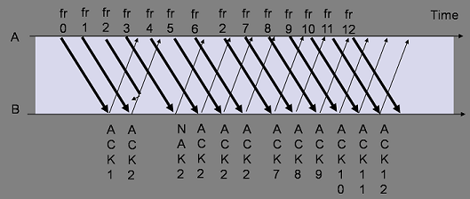

     窗口是缓存的一部分，用来暂时存放字节流。发送方和接收方各有一个窗口，接收方通过 TCP 报文段中的窗口字段告诉发送方自己的窗口大小，发送方根据这个值和其它信息设置自己的窗口大小。

     发送窗口内的字节都允许被发送，接收窗口内的字节都允许被接收。如果发送窗口左部的字节已经发送并且收到了确认，那么就将发送窗口向右滑动一定距离，直到左部第一个字节不是已发送并且已确认的状态；接收窗口的滑动类似，接收窗口左部字节已经发送确认并交付主机，就向右滑动接收窗口。

     接收窗口只会对窗口内最后一个按序到达的字节进行确认，例如接收窗口已经收到的字节为 {31, 34, 35}，其中 {31} 按序到达，而 {34, 35} 就不是，因此只对字节 31 进行确认。发送方得到一个字节的确认之后，就知道这个字节之前的所有字节都已经被接收。

     

38. **TCP流量控制**

    简单来说就是接收方处理不过来的时候，就把窗口缩小，并把窗口值告诉发送端。将窗口字段设置为 0，则发送方不能发送数据。

    

39. **TCP拥塞控制**

    如果网络出现拥塞，分组将会丢失，此时发送方会继续重传，从而导致网络拥塞程度更高。因此当出现拥塞时，应当控制发送方的速率。这一点和流量控制很像，但是出发点不同。流量控制是为了让接收方能来得及接收，而拥塞控制是为了降低整个网络的拥塞程度。

    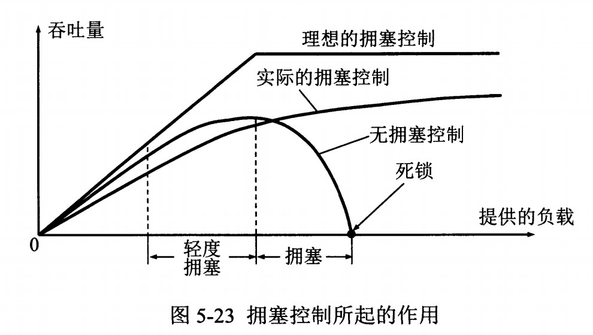

    TCP 主要通过四个算法来进行拥塞控制：慢开始、拥塞避免、快重传、快恢复。

    发送方需要维护一个叫做拥塞窗口（cwnd）的状态变量，注意拥塞窗口与发送方窗口的区别：拥塞窗口只是一个状态变量，实际决定发送方能发送多少数据的是发送方窗口。

    为了便于讨论，做如下假设：

    - 接收方有足够大的接收缓存，因此不会发生流量控制；
    - 虽然 TCP 的窗口基于字节，但是这里设窗口的大小单位为报文段。

    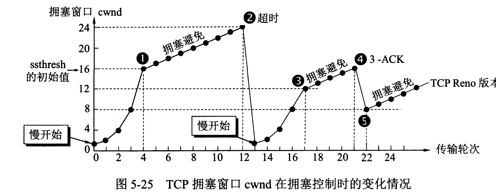

    1. **慢开始与拥塞避免**

       发送的最初执行慢开始，令 cwnd = 1，发送方只能发送 1 个报文段；当收到确认后，将 cwnd 加倍，因此之后发送方能够发送的报文段数量为：2、4、8 ...

       注意到慢开始每个轮次都将 cwnd 加倍，这样会让 cwnd 增长速度非常快，从而使得发送方发送的速度增长速度过快，网络拥塞的可能性也就更高。设置一个慢开始门限 ssthresh，当 cwnd >= ssthresh 时，进入拥塞避免，每个轮次只将 cwnd 加 1。

       如果出现了超时，则令 ssthresh = cwnd / 2，然后重新执行慢开始。

    2. **快重传和快恢复**

       在接收方，要求每次接收到报文段都应该对最后一个已收到的有序报文段进行确认。例如已经接收到 M1 和 M2，此时收到 M4，应当发送对 M2 的确认。

       在发送方，如果收到三个重复确认，那么可以知道下一个报文段丢失，此时执行快重传，立即重传下一个报文段。例如收到三个 M2，则 M3 丢失，立即重传 M3。

       在这种情况下，只是丢失个别报文段，而不是网络拥塞。因此执行快恢复，令 ssthresh = cwnd / 2 ，cwnd = ssthresh，注意到此时直接进入拥塞避免。

       慢开始和快恢复的快慢指的是 cwnd 的设定值，而不是 cwnd 的增长速率。慢开始 cwnd 设定为 1，而快恢复 cwnd 设定为 ssthresh。

       

40. **ARP协议的工作过程**

    1. 首先，每个主机都会在自己的ARP缓冲区中建立一个ARP列表，以表示本局域网上的各主机的IP地址到MAC地址的映射表。
    2. 当源主机要发送数据时，首先检查ARP列表中是否有对应IP地址的目的主机的MAC地址，如果有，则直接发送数据；如果没有，就向本网段中的所有主机发送ARP数据包，该数据包包括的内容有：源主机IP地址、源主机MAC地址、目的主机IP地址。
    3. 当本网段中的所有主机收到该ARP数据包时，首先检查数据包中的IP地址是否是自己的IP地址，如果不是，则忽略该数据包；如果是，则首先从数据包中取出源主机的IP地址和MAC地址写入到ARP列表中，如果已经存在则覆盖，然后将自己的MAC地址写入ARP响应包中，告诉源主机自己是它想要找的MAC地址。
    4. 源主机收到ARP响应包后，将目的主机的IP地址和MAC地址写入ARP列表，并利用此信息发送数据。如果源主机一直没有收到ARP响应包，表示ARP查询失败。

    - ARP是解决**同一个局域网上**的主机或路由器的IP地址和硬件地址的映射问题。

41. **DHCP解析**

    1. **IP 协议**需要参与通信的网络设备接口具有 **IP 地址**。一个局域网会经常接入新的主机，而接入局域网的主机也可能随时离开该局域网，这就让人工手动的分配 **IP 地址**几乎成为了不可能。**DHCP 协议**就是解决动态分配 **IP 地址**的**应用层协议**。

    2. **动态主机配置协议(DHCP, Dynamic Host Configuration Protocol)** 是一种基于 **UDP/IP** 网络的网络管理协议。**DHCP 服务器**动态的分配 **IP 地址**和其他网络配置参数给网络中的每个设备，以使它们可以跟其他的 **IP** 网络通信。

    3. DHCP协议的基本内容：

       - **初始状态**： 在如下图的**局域网**中，新加入**主机H1**。

         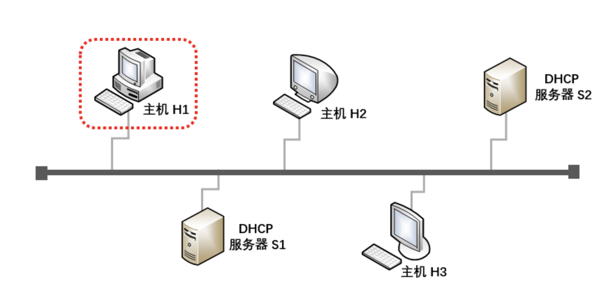

       - **DHCP Discovery**：**主机 H1** 发现自己没有 **IP 地址**，就会用 **0.0.0.0:68** 作为自己的地址，发送 **DHCPDISCOVER** 消息到广播地址 **255.255.255.255:67**，以发现可用的 **IP 地址**。

         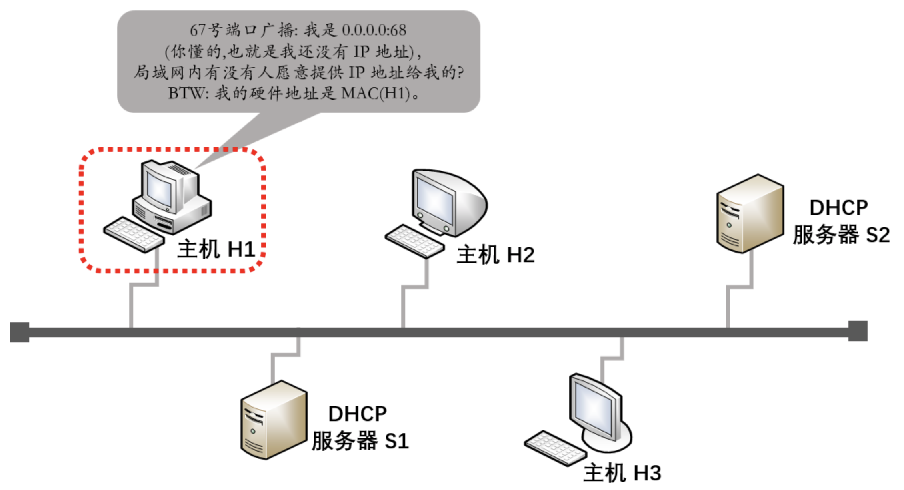

       - DHCP Offer：主机 H1 广播的 DHCPDISCOVER 消息在整个局域网内传输，“看不懂”的网络设备(如，图中的主机 H2 和主机 H3)就直接将收到的包丢弃。DHCP 服务器 收到该消息后，就会从自己的 IP 地址池中取出一个 IP 地址提供给 主机 H1，并通过广播告诉主机 H1。如图中的 DHCP 服务器 S1 和 DHCP 服务器 S2 都从自己的 IP 地址池中取出一个 IP 地址(IP1 和 IP2)，提供 Offer 给主机 H1。

         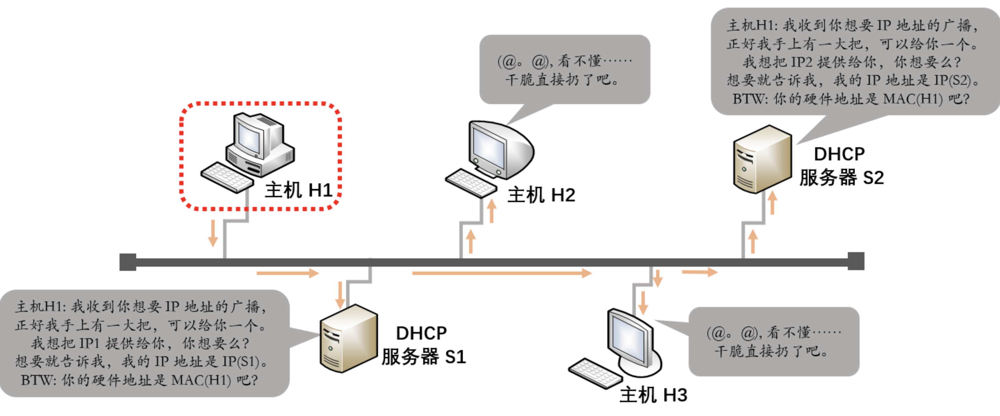

       - **主机 H1** 接收到 **DHCP 服务器 S1** 提供的 **IP1** 的 **Offer** 和  **DHCP 服务器 S2** 提供的 **IP2** 的 **Offer** 。它会选择自己感兴趣的地址，如 **IP1**，发送请求该 **IP 地址** 的消息。

         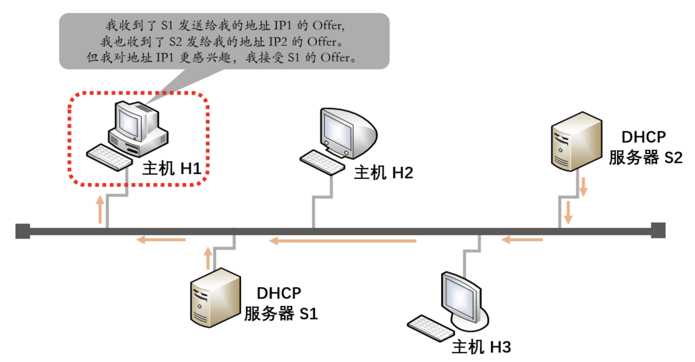

       - **DHCP Request**: **主机 H1** 选择接收 **DHCP 服务器 S1** 提供的 **IP1** 的 **Offer**。它将会在网络广播对 **IP1** 的 **DHCPREQUEST** 请求。

         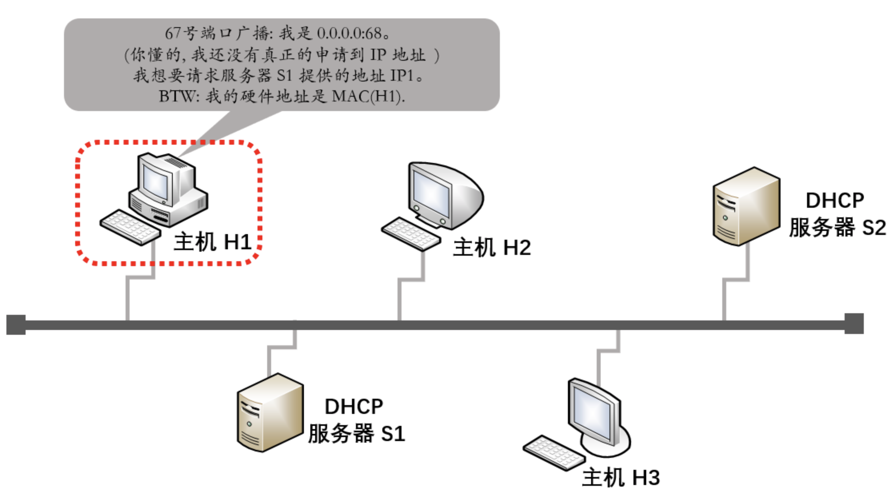

       - DHCP Acknowledgement：当 DHCP 服务器 S2 接收到主机 H1 接收 服务器 S1 的提供的 IP1 的 DHCPREQUEST 消息时，将自己提供的 IP2 放入地址池，等待其他网络设备请求。而 主机 H1 接收到 DHCPREQUEST 消息 后，确认主机 H1愿意接收自己提供的 IP1。此时如果 IP1 没有分配出去，则将主机 H1 绑定 IP1，并回复一个 DHCPACK 消息给 主机 H1。

         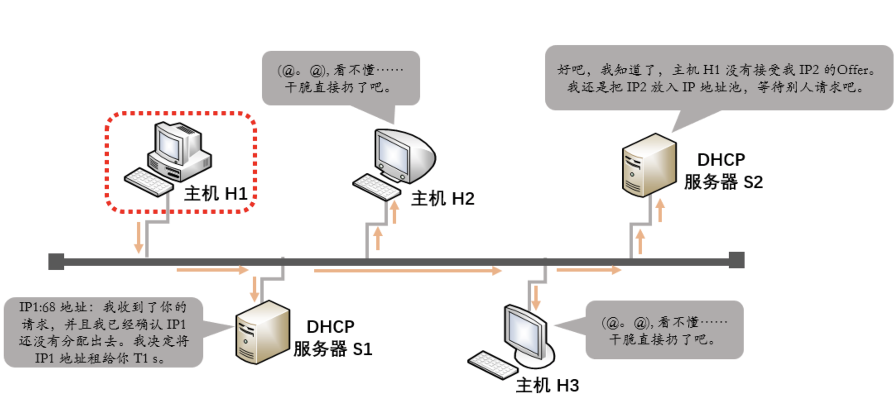

42. **DNS解析域名**

    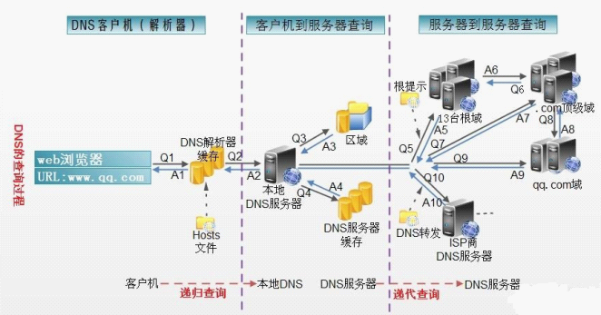

    - 在浏览器中输入www.qq.com域名，操作系统会先检查自己本地的hosts文件是否有这个网址映射关系，如果有，就先调用这个IP地址映射，完成域名解析。
    - 如果hosts里没有这个域名的映射，则查找本地DNS解析器缓存，是否有这个网址映射关系，如果有，直接返回，完成域名解析。
    - 如果hosts与本地DNS解析器缓存都没有相应的网址映射关系，首先会找TCP/IP参数中设置的首选DNS服务器，在此我们叫它本地DNS服务器，此服务器收到查询时，如果要查询的域名，包含在本地配置区域资源中，则返回解析结果给客户机，完成域名解析，此解析具有权威性。
    - 如果要查询的域名，不由本地DNS服务器区域解析，但该服务器已缓存了此网址映射关系，则调用这个IP地址映射，完成域名解析，此解析不具有权威性。
    - 如果本地DNS服务器本地区域文件与缓存解析都失效，则根据本地DNS服务器的设置(是否设置转发器)进行查询，如果未用转发模式，本地DNS就把请求发至13台根DNS，根DNS服务器收到请求后会判断这个域名(.com)是谁来授权管理，并会返回一个负责该顶级域名服务器的一个IP。本地DNS服务器收到IP信息后，将会联系负责.com域的这台服务器。这台负责.com域的服务器收到请求后，如果自己无法解析，它就会找一个管理.com域的下一级DNS服务器地址(qq.com)给本地DNS服务器。当本地DNS服务器收到这个地址后，就会找qq.com域服务器，重复上面的动作，进行查询，直至找到www.qq.com主机。
    - 如果用的是转发模式，此DNS服务器就会把请求转发至上一级DNS服务器，由上一级服务器进行解析，上一级服务器如果不能解析，或找根DNS或把转请求转至上上级，以此循环。不管是本地DNS服务器用的是转发，还是根提示，最后都是把结果返回给本地DNS服务器，由此DNS服务器再返回给客户机。

43. **URL的输入到浏览器解析的一系列事件**

    1. DNS解析

    2. 发起TCP连接

    3. 发送HTTP请求

       1. HTTP的端口为80/8080，而HTTPS的端口为443

       2. 发送HTTP请求的过程就是构建HTTP请求报文并通过TCP协议中发送到服务器指定端口，请求报文由**请求行**，**请求抱头**，**请求正文**组成。

       3. 请求行的格式为`Method Request-URL HTTP-Version CRLF` `eg: GET index.html HTTP/1.1` 常用的方法有: `GET`,`POST`, `PUT`, `DELETE`, `OPTIONS`, `HEAD`。

       4. POST和GET的区别

          - GET在浏览器回退时是无害的，而POST会再次提交请求。
          - GET产生的URL地址可以被Bookmark，而POST不可以。
          - GET请求会被浏览器主动cache，而POST不会，除非手动设置。
          - GET请求只能进行url编码，而POST支持多种编码方式。
          - GET请求参数会被完整保留在浏览器历史记录里，而POST中的参数不会被保留。
          - GET请求在URL中传送的参数是有长度限制的，而POST没有。
          - 对参数的数据类型，GET只接受ASCII字符，而POST没有限制。
          - GET比POST更不安全，因为参数直接暴露在URL上，所以不能用来传递敏感信息。
          - GET参数通过URL传递，POST放在Request body中。
          - `GET`会产生一个`TCP`数据包，而`POST`会产生两个`TCP`数据包。
            - 对于GET方式的请求，浏览器会把http header和data一并发送出去，服务器响应200(返回数据);
            - 而对于POST，浏览器先发送header，服务器响应100 continue，浏览器再发送data，服务器响应200 ok(返回数据)。

       5. HTTP缓存

          1. HTTP属于客户端缓存，我们常认为浏览器有一个缓存数据库，用来保存一些静态文件。

          2. 缓存规则分为**强制缓存**和**协商缓存**

             - 强制缓存：当缓存数据库中有客户端需要的数据，客户端直接将数据从其中拿出来使用（如果数据未失效），当缓存服务器没有需要的数据时，客户端才会向服务端请求。

               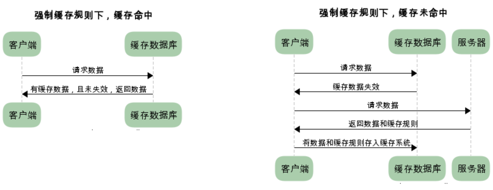

             - 协商缓存：客户端会先从缓存数据库拿到一个缓存的标识，然后向服务端验证标识是否失效，如果没有失效服务端会返回304，这样客户端可以直接去缓存数据库拿出数据，如果失效，服务端会返回新的数据。

               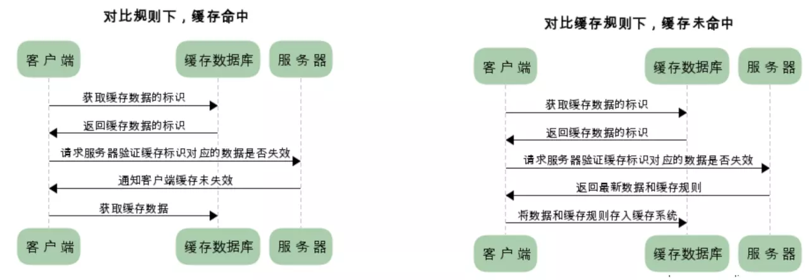

             - 强制缓存的优先级高于协商缓存，若两种缓存皆存在，且强制缓存命中目标，则协商缓存不再验证标识。

          3. 缓存的优点：

             - 减少了冗余的数据传递，节省宽带流量
             - 减少了服务器的负担，大大提高了网站性能
             - 加快了客户端加载网页的速度 这也正是HTTP缓存属于客户端缓存的原因。

          4. 不同刷新的请求执行过程

             1. 浏览器地址栏写入URL，回车
                - 浏览器发现缓存中有这个文件了，不用继续请求了，直接去缓存拿。（最快）
             2. F5
                - F5就是告诉浏览器，别偷懒，好歹去服务器看看这个文件是否有过期了。于是浏览器就战战兢兢的发送一个请求带上If-Modify-since。
             3. Ctrl+F5
                - 告诉浏览器，你先把你缓存中的这个文件给我删了，然后再去服务器请求个完整的资源文件下来。于是客户端就完成了强行更新的操作。

    4. 服务器处理请求并返回HTTP报文

       它会对TCP连接进行处理，对HTTP协议进行解析，并按照报文格式进一步封装成HTTP Request对象，供上层使用。这一部分工作一般是由Web服务器去进行，我使用过的Web服务器有Tomcat, Nginx和Apache等等 HTTP报文也分成三份，**状态码**，**响应报头**和**响应报文**。

       - 状态码

         状态码是由3位数组成，第一个数字定义了响应的类别，且有五种可能取值:

         - 1xx：指示信息–表示请求已接收，继续处理。

         - 2xx：成功–表示请求已被成功接收、理解、接受。

         - 3xx：重定向–要完成请求必须进行更进一步的操作。

         - 4xx：客户端错误–请求有语法错误或请求无法实现。

         - 5xx：服务器端错误–服务器未能实现合法的请求。

          平时遇到比较常见的状态码有:200, 204, 301, 302, 304, 400, 401, 403, 404, 422, 500

       - 常见状态码区别

         - 200 成功

           请求成功，通常服务器提供了需要的资源。

         - 204 无内容

           服务器成功处理了请求，但没有返回任何内容。

         - 301 永久移动

           请求的网页已永久移动到新位置。 服务器返回此响应（对 GET 或 HEAD 请求的响应）时，会自动将请求者转到新位置。

         - 302 临时移动

           服务器目前从不同位置的网页响应请求，但请求者应继续使用原有位置来进行以后的请求。

         - 304 未修改

           自从上次请求后，请求的网页未修改过。 服务器返回此响应时，不会返回网页内容。

         - 400 错误请求

           服务器不理解请求的语法。

         - 401 未授权

           请求要求身份验证。 对于需要登录的网页，服务器可能返回此响应。

         - 403 禁止

           服务器拒绝请求。

         - 404 未找到

           服务器找不到请求的网页。

         - 422 无法处理

           请求格式正确，但是由于含有语义错误，无法响应

         - 500 服务器内部错误

           服务器遇到错误，无法完成请求。

    5. 浏览器解析渲染页面

    6. 连接结束。

44. **抽象类和接口**

    1. 抽象类
       - 抽象类和抽象方法都使用 abstract 关键字进行声明。如果一个类中包含抽象方法，那么这个类必须声明为抽象类。
       - 抽象类和普通类最大的区别是，抽象类不能被实例化，需要继承抽象类才能实例化其子类。
    2. 接口
       - 接口是抽象类的延伸，在 Java 8 之前，它可以看成是一个完全抽象的类，也就是说它不能有任何的方法实现。
       - 从 Java 8 开始，接口也可以拥有默认的方法实现，这是因为不支持默认方法的接口的维护成本太高了。在 Java 8 之前，如果一个接口想要添加新的方法，那么要修改所有实现了该接口的类。
       - 接口的成员（字段 + 方法）默认都是 public 的，并且不允许定义为 private 或者 protected。
       - 接口的字段默认都是 static 和 final 的。
    3. 比较
       - 从设计层面上看，抽象类提供了一种 IS-A 关系，那么就必须满足里式替换原则，即子类对象必须能够替换掉所有父类对象。而接口更像是一种 LIKE-A 关系，它只是提供一种方法实现契约，并不要求接口和实现接口的类具有 IS-A 关系。
       - 从使用上来看，一个类可以实现多个接口，但是不能继承多个抽象类。
       - 接口的字段只能是 static 和 final 类型的，而抽象类的字段没有这种限制。
       - 接口的成员只能是 public 的，而抽象类的成员可以有多种访问权限。
    4. 使用选择
       - 使用接口：
         - 需要让不相关的类都实现一个方法，例如不相关的类都可以实现 Compareable 接口中的 compareTo() 方法；
         - 需要使用多重继承。
       - 使用抽象类：
         - 需要在几个相关的类中共享代码。
         - 需要能控制继承来的成员的访问权限，而不是都为 public。
         - 需要继承非静态和非常量字段。

45. **接口字段为什么都是static final的**

    1. static：因为接口是可以多继承的。如果一个类实现了两个接口，且两个接口都具有相同名字的变量，此时这个变量可以被实现类使用，那么如果不是static的，这个变量来自哪一个接口就会产生歧义，所以实现类使用接口中的变量必须通过接口名指定，也就只能定为static的。
    2. final：因为必须是static的，那么所有子类共享，而接口是一种抽象， 所以一个子类修改了值会影响到其他所有子类，因此就不应该允许子类修改这个值，所以定义为final。

46. **反射**

    1. 反射是 Java 的特征之一，它允许运行中的 Java 程序获取自身的信息，并且可以操作类或对象的内部属性。核心是 JVM 在运行时才动态加载类或调用方法/访问属性，它不需要事先（写代码的时候或编译期）知道运行对象是谁。
    2. Java 反射主要提供以下功能：
       - 在运行时判断任意一个对象所属的类；
       - 在运行时构造任意一个类的对象；
       - 在运行时判断任意一个类所具有的成员变量和方法（通过反射甚至可以调用private方法）；
       - 在运行时调用任意一个对象的方法
    3. **反射最重要的用途就是开发各种通用框架。**很多框架（比如 Spring）都是配置化的（比如通过 XML 文件配置 Bean），为了保证框架的通用性，它们可能需要根据配置文件加载不同的对象或类，调用不同的方法，这个时候就必须用到反射，运行时动态加载需要加载的对象。
    4. 反射的优点：
       - **可扩展性** ：应用程序可以利用全限定名创建可扩展对象的实例，来使用来自外部的用户自定义类。
       - **类浏览器和可视化开发环境** ：一个类浏览器需要可以枚举类的成员。可视化开发环境（如 IDE）可以从利用反射中可用的类型信息中受益，以帮助程序员编写正确的代码。
       - **调试器和测试工具** ： 调试器需要能够检查一个类里的私有成员。测试工具可以利用反射来自动地调用类里定义的可被发现的 API 定义，以确保一组测试中有较高的代码覆盖率。
    5. 反射的缺点：
       - **性能开销** ：反射涉及了动态类型的解析，所以 JVM 无法对这些代码进行优化。因此，反射操作的效率要比那些非反射操作低得多。我们应该避免在经常被执行的代码或对性能要求很高的程序中使用反射。
       - **安全限制** ：使用反射技术要求程序必须在一个没有安全限制的环境中运行。如果一个程序必须在有安全限制的环境中运行，如 Applet，那么这就是个问题了。
       - **内部暴露** ：由于反射允许代码执行一些在正常情况下不被允许的操作（比如访问私有的属性和方法），所以使用反射可能会导致意料之外的副作用，这可能导致代码功能失调并破坏可移植性。反射代码破坏了抽象性，因此当平台发生改变的时候，代码的行为就有可能也随着变化。

47. **Java多态的原理**

    1. 对于多态的原理主要研究方法区。在Java中多态指的是它允许基类的指针或引用指向派生类的对象，而在具体访问时实现方法的动态绑定。Java中的方法调用有静态绑定和动态绑定之分，静态绑定指的是我们在编译期就已经确定了会执行那个方法的字节码，而动态绑定只有在运行时才能知晓。

    2. 静态绑定

       -  Java中的静态方法、私有方法以及final修饰的方法的调用，都属于静态绑定，对于重载的实例方法的

         调用，也是采用静态绑定。

       - 静态绑定的原理主要是一个常量池解析的过程，下面来详解其过程：

         假如有两个类A、B，在A类中我们调用了B类中的一个静态方法，在编译期，这个调用的动作会被编译成一条静态调用指令，该指令就对应常量池中的CONSTANT_Methodref表中所存储的该方法的符号引用，通过这个符号引用可以得到静态方法的全类名B，JVM加载B类，便会得到B类中方法的直接地址，该地址会被存储到A类常量池中对应的常量表中，这便是常量池解析过程，再次发起调用时，就会直接根据这个直接地址调用对应方法。

    3. 动态绑定

       - 动态绑定讲解之前需要了解JVM管理的一个重要的数据结构--方法表。它以数组的形式记录了当前类及其所有超类的可见方法字节码在内存中的直接地址 。

         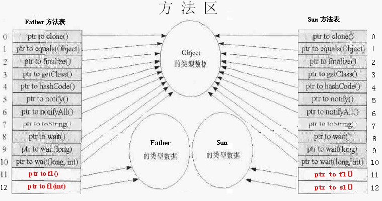

       - 动态绑定前面的流程与静态绑定类似，假如此处有两个类A，B继承了A类，B类中重写了A类中的f1( )方法，我们采用向上转型的方式用指向B实例的A类型引用调用f1( )方法，编译器会生成一条字节码指令，该指令会去常量表中找到f1( )方法信息的符号引用，通过该引用确定调用该方法的类型全名，即A类的全名称，根据名称加载到A类的字节码，去A类所对应的方法表中找到f1( )方法，将它的直接地址记录到调用f1( )方法的类的对应的常量表中，常量池解析结束。

       - 可以思考，我们此时是否能确定调用f1( )方法时执行的是哪一块的字节码，答案是不能，因为截至此时我们f1( )方法指定执行的是父类中的方法，引用虽然父类类型，但他指向的是父类对象还是子类对象是不知道的(确切地说是此时的程序不知道，程序员肯定是知道的)，假如指向父类那就是父类中的f1( )方法，如果指向子类的实例，子类没有重写，依然执行父类f1( )方法，如果子类重写了就应该是子类的f1( )方法。此时动态绑定就登场了，确定f1( )换需要拿到B类实例在堆中的引用，通过引用找到堆中B的对象，根据对象进一步获取它的方法表，找到方法表的f1( )方法的直接地址，此时便最终确定了。

48. **http和https的区别**

    1. https协议需要到ca申请证书，一般免费证书较少，因而需要一定费用。
    2. http是超文本传输协议，信息是明文传输，https则是具有安全性的ssl加密传输协议。
    3. http和https使用的是完全不同的连接方式，用的端口也不一样，前者是80，后者是443。
    4. http的连接很简单，是无状态的；HTTPS协议是由SSL+HTTP协议构建的可进行加密传输、身份认证的网络协议，比http协议安全。

49. **HTTPS工作原理**

    1. 客户端发起HTTPS请求
       用户在浏览器里输入一个https网址，然后连接到server的443端口。
    2. 服务端的配置
       采用HTTPS协议的服务器必须要有一套数字证书，可以自己制作，也可以向组织申请，区别就是自己颁发的证书需要客户端验证通过，才可以继续访问，而使用受信任的公司申请的证书则不会弹出提示页面。
    3. 传送证书
       这个证书其实就是公钥，只是包含了很多信息，如证书的颁发机构，过期时间等等。
    4. 客户端解析证书
       这部分工作是由客户端的TLS来完成的，首先会验证公钥是否有效，比如颁发机构，过期时间等等，如果发现异常，则会弹出一个警告框，提示证书存在问题。
       （1）首先浏览器读取证书中的证书所有者、有效期等信息进行一一校验
       （2）浏览器开始查找操作系统中已内置的受信任的证书发布机构CA，与服务器发来的证书中的颁发者CA比对，用于校验证书是否为合法机构颁发
       （3）如果找不到，浏览器就会报错，说明服务器发来的证书是不可信任的。
       （4）如果找到，那么浏览器就会从操作系统中取出颁发者CA 的公钥(多数浏览器开发商发布
       版本时，会事先在内部植入常用认证机关的公开密钥)，然后对服务器发来的证书里面的签名进行解密
       （5）浏览器使用相同的hash算法计算出服务器发来的证书的hash值，将这个计算的hash值与证书中签名做对比
       （6）对比结果一致，则证明服务器发来的证书合法，没有被冒充
       （7）此时浏览器就可以读取证书中的公钥，用于后续加密了
    5. 传送加密信息
       这部分传送的是用证书加密后的随机值(私钥)，目的就是让服务端得到这个随机值，以后客户端和服务端的通信就可以通过这个随机值来进行加密解密了。
    6. 服务端解密信息
       服务端用私钥解密后，得到了客户端传过来的随机值(私钥)，然后把内容通过该值进行对称加密
    7. 传输加密后的信息
       这部分信息是服务端用私钥加密后的信息，可以在客户端被还原。
    8. 客户端解密信息
       客户端用之前生成的私钥解密服务端传过来的信息，于是获取了解密后的内容，整个过程第三方即使监听到了数据，也束手无策。

    

50. **synchronized修饰static方法和修饰非static方法的区别**

    1. 当synchronized修饰一个static方法时，多线程下，获取的是类锁（即Class本身，注意：不是实例），作用范围是整个静态方法，作用的对象是这个类的所有对象。
    2. 当synchronized修饰一个非static方法时，多线程下，获取的是对象锁（即类的实例对象），作用范围是整个方法，作用对象是调用该方法的对象。
    3. **类锁和对象锁不同，他们之间不会产生互斥。**

51. **数组的初始化**

    1. 基本类型数组的初始化

       初始化数组时，先为该数组分配内存空间，然后直接将数组元素的值存入对应数组元素中。

       > public class BasicArrayTest {
       > 	public static void main(String[] args) {
       > 		// 定义一个int[]类型的数组变量
       > 		int[] arr;
       > 		// 动态初始化数组,数组长度为5
       > 		arr = new int[5];
       > 		// 采用循环方式为每个数组元素复制
       > 		for(int i = 0; i < arr.length; i++) {
       > 			arr[i] = i;
       > 		}
       > 	}
       >
       > }

       1. 执行`int[] arr`时，仅定义一个数组变量，此时内存中的存储示意图如下：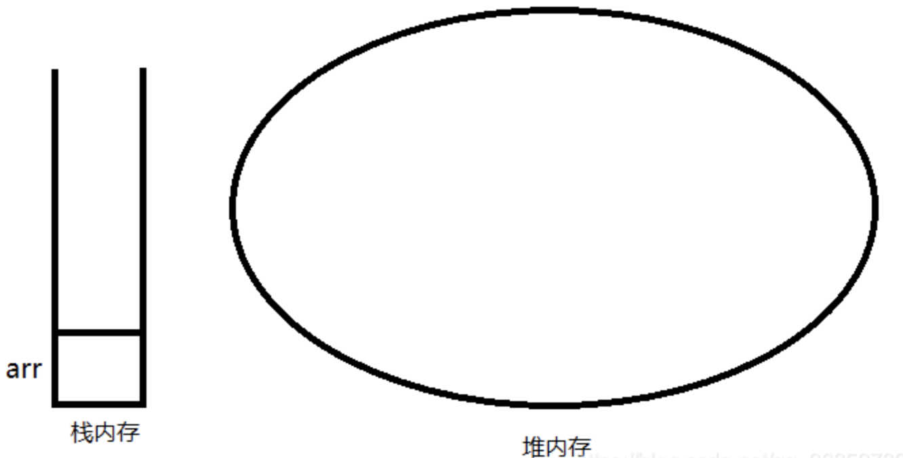仅在栈内存中定义了一个空引用（就是arr数组变量），这个引用并未指向任何有效的内存,故在初始化时无法指定数组的长度,
       2. 执行`arr = new int[5];`动态初始化后,系统将负责将为该数组分配内存空间,并分配默认的初始值：所有数组元素都被赋值为0，此时内存中的存储示意图如下图：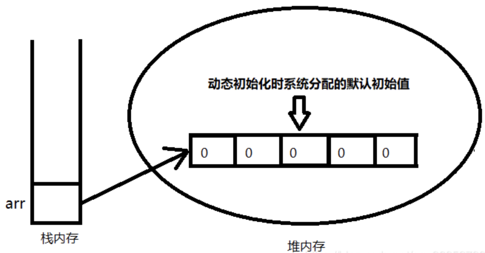
       3. 执行循环为该数组的每个数组元素依次赋值后，此时每个数组元素的值都变成程序显示指定的值，显示指定每个数组元素值后的存储示意图如下: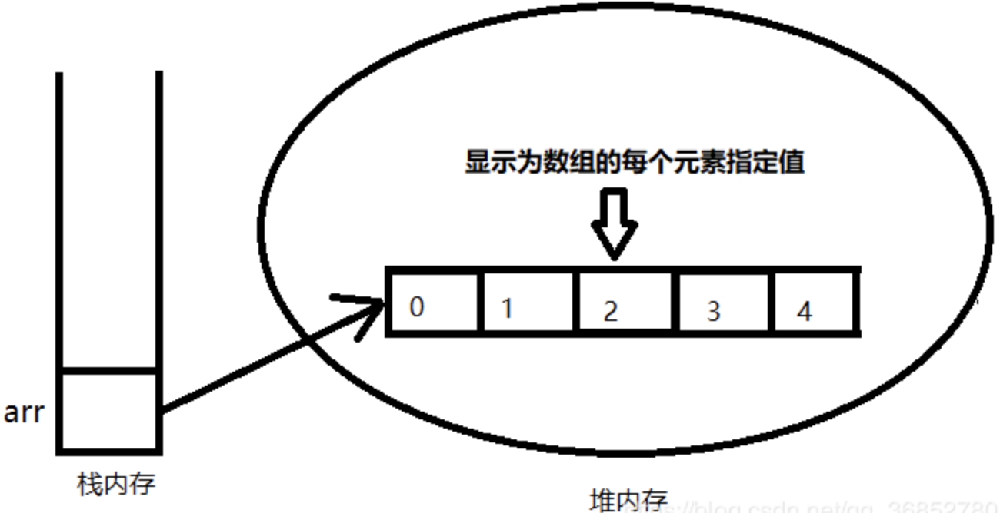
       4. 每个数组元素的值直接存储在对应的内存中，操作基本类型数组的数组元素时，实际上就是操作基本类型的变量。

    2. 引用类型数组的初始化

       引用类型数组的数组元素是引用,因此更复杂些，每个数组元素里存储的还是引用，它指向另一块内存，这块内存里存储了有效数据。

       定义一个Person类：

       > class Person {
       > 	public int age;
       > 	public double height;
       > 	public void info() {
       > 		System.out.println("My age is: " + age + ", My height is: " + height);
       > 	}
       >
       > }

       定义一个Person[]数组，接着动态初始化这个Person[]数组，并为这个数组的每个数组元素指定值。

       > public class ReferenceArrayTest {
       > 	public static void main(String[] args) {
       > 		// 定义一个students数组变量,其类型是Person[]
       > 		Person[] students;
       > 		// 执行动态初始化
       > 		students = new Person[2];
       > 		// 创建一个Person实例,并将这个Person实例赋给zhang变量
       > 		Person zhang = new Person();
       > 		// 为zhang所引用的Person对象的age,height赋值
       > 		zhang.age = 15;
       > 		zhang.height = 175;
       > 		// 创建一个Person实例,并将这个Person实例赋给li变量
       > 		Person li = new Person();
       > 		// 为li所引用的Person对象的age,height赋值
       > 		li.age = 18;
       > 		li.height = 183;
       > 		// 将zhang变量的值赋给第一个数组元素
       > 		student[0] = zhang;
       > 		// 将li变量的值赋给第二个数组元素
       > 		students[1] = li;
       > 		// 下面两行代码的结果完全一样,因为li和students[1]指向的是同一个Person实例
       > 		li.info();
       > 		students[1].info();
       > 	}
       >
       > }

       1. 执行`Person[] students;`，这行代码仅在栈内存中定义了一个引用变量，也就是一个指针，这个指针并未指向任何有效的内存区.此时内存中的存储示意图如下：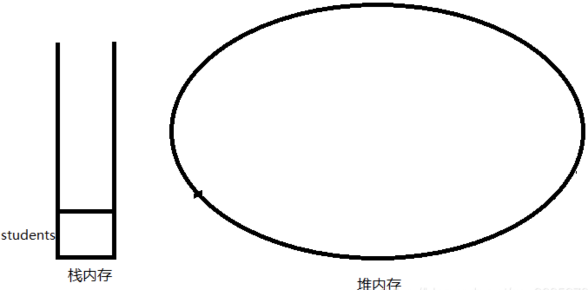它仅仅是一个引用，并未指向任何有效的内存。
       2. 执行动态初始化时,`students = new Person[2];`，动态初始化由系统为数组元素分配默认的初始值：null，即每个数组元素的值都是null。执行动态初始化后的存储示意图如下图：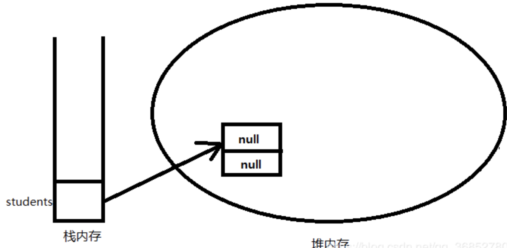每个数组元素的值都是null。这意味着依然不能直接使用students数组元素，因为每个数组元素都是null，顶一个两个连续的Person变量，但这个变量还未指向任何有效的内存区。
       3. 接着定义了`zhang和li两个Person实例`，定义这两个实例实际上分配了4块内存，在栈内存中存储了zhang和li两个引用变量，还在堆内存中存储了两个Person实例.此时内存存储示意图如下：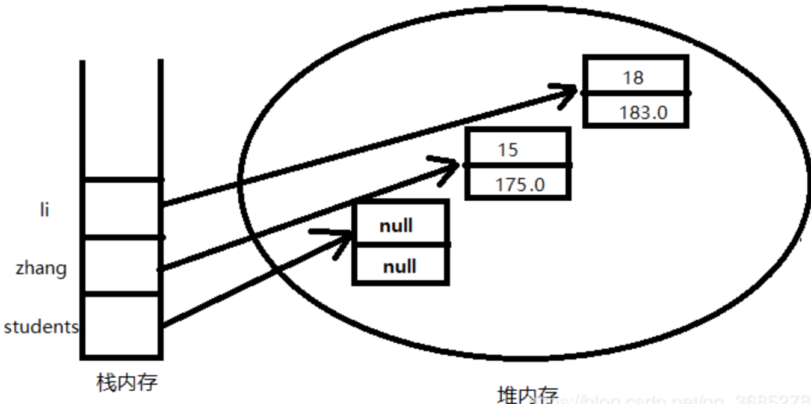
       4. `将zhang赋给students数组的第一个元素，把li赋给students数组的第二个元素`，students数组的两个数组元素将会指向有效的内存区。此时的内存存储示意图如下：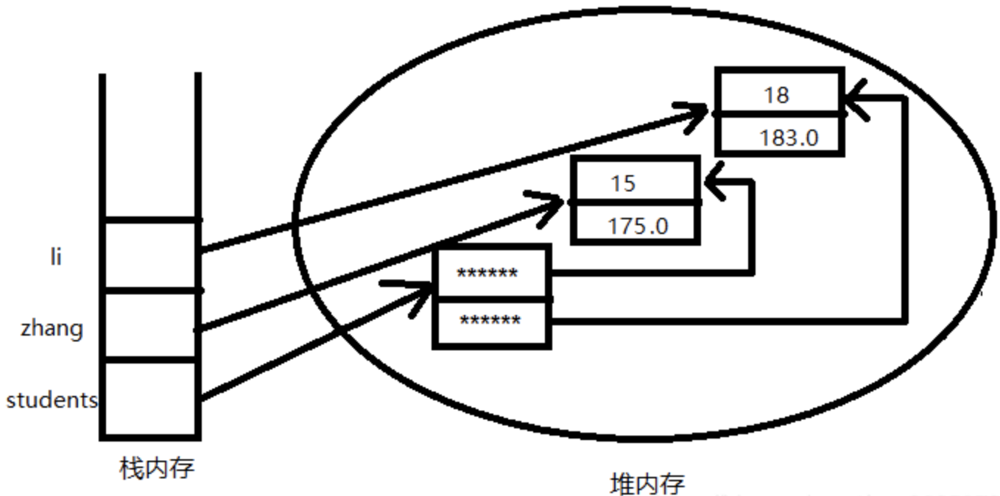
       5. 此时zhang和students[0]指向同一个内存区，而且它们都是引用类型变量，因此通过zhang和students[0]来访问Person实例的Field和方法的效果完全一样，不论修改students[0]还是zhang变量所指向的Person实例的Field，所修改的其实是同一个内存区，所以必然相互影响。

52. **int和Integer的区别**

    int是基本数据类型，int变量存储的是数值。Integer是引用类型，实际是一个对象，Integer存储的是引用对象的地址。

53. **消息队列**

    - 使用场景

      - 应用解耦

        如果模块之间不直接进行调用，模块之间耦合度就会很低，那么修改一个模块或者新增一个模块对其它模块的影响会很小，从而实现可扩展性。

        通过使用消息队列，一个模块只需要向消息队列中发送消息，其它模块可以选择性地从消息队列中订阅消息从而完成调用。

        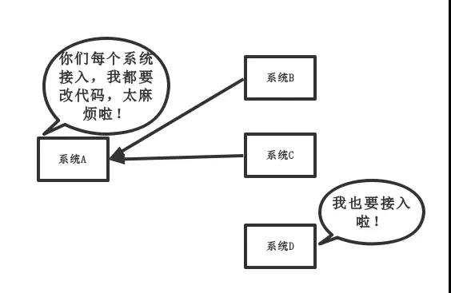

        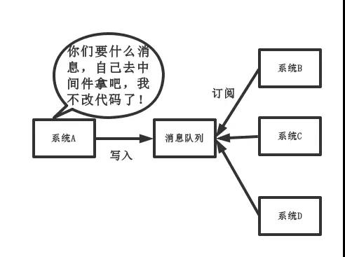

      - 异步处理

        发送者将消息发送给消息队列之后，不需要同步等待消息接收者处理完毕，而是立即返回进行其它操作。消息接收者从消息队列中订阅消息之后异步处理。

        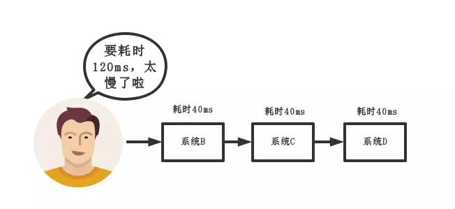

        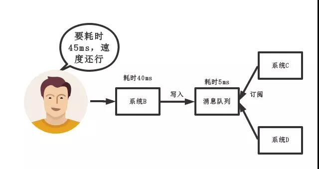

      - 流量削峰

        在高并发的场景下，如果短时间有大量的请求到达会压垮服务器。

        可以将请求发送到消息队列中，服务器按照其处理能力从消息队列中订阅消息进行处理。

        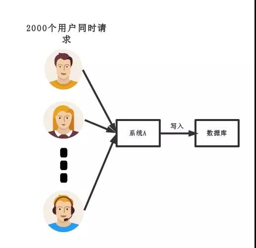

        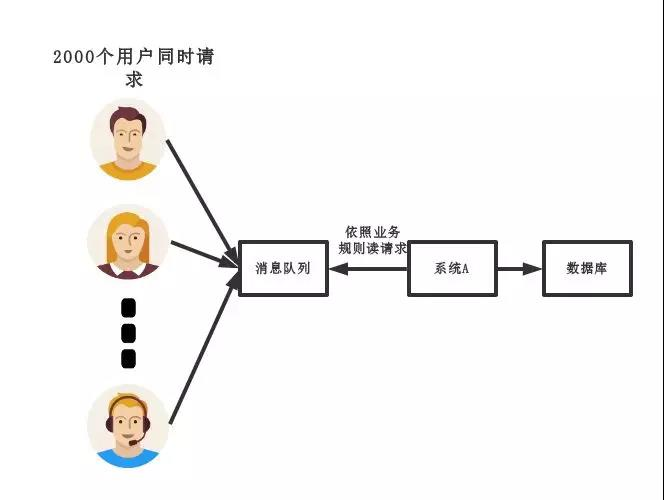

    - 消息队列的缺点

      - 系统可用性降低：你想呀，本来其他系统只要运行好好的，那你的系统就是正常的。现在你非要加入个消息队列进去，那消息队列挂了，你的系统不是呵呵了。因此，系统可用性会降低
      - 系统复杂性增加：加入了消息队列，要多考虑很多方面的问题，比如：一致性问题、如何保证消息不被重复消费、如何保证消息可靠性传输等。因此，需要考虑的东西更多，系统复杂性增大。
      
    - 消息队列消息序列化

      不同语言有不同的数据序列化方式，当然也有着具有兼容性的序列化方式

      - Binary
      - JSON
      - XML

54. **一致性hash**

    - 一致性hash算法

      1. 首先求出memcached服务器（节点）的哈希值，并将其配置到0～2^32 - 1的圆（continuum）上。
      2. 然后采用同样的方法求出存储数据的键的哈希值，并映射到相同的圆上。
      3. 然后从数据映射到的位置开始顺时针查找，将数据保存到找到的第一个服务器上。如果超过2^32仍然找不到服务器，就会保存到第一台memcached服务器上。

    - 一致性hash性质

      - 平衡性

        平衡性也就是说负载均衡，是指客户端hash后的请求应该能够分散到不同的服务器上去。一致性hash可以做到每个服务器都进行处理请求，但是不能保证每个服务器处理的请求的数量大致相同。

      - 单调性

        单调性是指如果已经有一些请求通过哈希分派到了相应的服务器进行处理，又有新的服务器加入到系统中时候，应保证原有的请求可以被映射到原有的或者新的服务器中去，而不会被映射到原来的其它服务器上去。

      - 分散性

        在分布式环境中，终端有可能看不到所有的缓冲，而是只能看到其中的一部分。当终端希望通过哈希过程将内容映射到缓冲上时，由于不同终端所见的缓冲范围有可能不同，从而导致哈希的结果不一致，最终的结果是相同的内容被不同的终端映射到不同的缓冲区中。这种情况显然是应该避免的，因为它导致相同内容被存储到不同缓冲中去，降低了系统存储的效率。分散性的定义就是上述情况发生的严重程度。好的哈希算法应能够尽量避免不一致的情况发生，也就是尽量降低分散性。

    - 当服务器节点比较少出现hash倾斜时，可以使用虚拟节点进行解决。

55. **红黑树和AVL树比较**

    1. AVL更平衡，结构上更加直观，时间效能针对读取而言更高；维护稍慢，空间开销较大。
    2. 红黑树，读取略逊于AVL，维护强于AVL，空间开销与AVL类似，内容极多时略优于AVL，维护优于AVL。
    3. 红黑树的查询性能略微逊色于AVL树，因为其比AVL树会稍微不平衡最多一层，也就是说红黑树的查询性能只比相同内容的AVL树最多多一次比较，但是，红黑树在插入和删除上优于AVL树，AVL树每次插入删除会进行大量的平衡度计算，而红黑树为了维持红黑性质所做的红黑变换和旋转的开销，相较于AVL树为了维持平衡的开销要小得多
    4. 若搜索的次数远远大于插入和删除，那么选择AVL，如果搜索，插入删除次数几乎差不多，应该选择RB。

56. **发布订阅模式**

    在软件架构中，发布/订阅是一种消息范式，消息的发送者（称为发布者）不会将消息直接发送给特定的接收者（称为订阅者），而是通过消息通道广播出去，让订阅该消息主题的订阅者消费到。

    - 发布订阅模式的优点

      1. 松耦合

         发布/订阅者模式可以将众多需要通信的子系统解耦，每个子系统都可以独立管理。而且即使部分子系统下线了，也不会影响系统消息的整体管理。

         发布/订阅者模式为应用程序提供了关注点分离。每个应用程序都可以专注于其核心功能，而消息传递基础结构负责将消息路由到每个消费者手里。

      2. 高伸缩性

         发布/订阅者模式增加了系统的可伸缩性，并提高了发送者的响应能力。原因是发送方可以快速地向输入通道发送一条消息，然后返回到其核心处理职责，而不必等待子系统处理完成。然后消息传递的基础结构负责确保把消息传递到每个订阅者手里。

      3. 高可靠性

         发布/订阅者模式提高了可靠性。异步的消息传递有助于应用程序在增加的负载下继续平稳运行，并且可以更有效地处理间歇性故障。

      4. 灵活性

         发布/订阅者模式允许延迟处理或者按计划的处理。例如当系统负载大的时候，订阅者可以等到非高峰时间才接收消息，或者根据特定的计划处理消息。

      5. 可测试性

         发布/订阅者模式提高了可测试性。通道可以被监视，消息可以作为整体集成测试策略的一部分而被检查或记录。

    - 发布订阅模式使用场景

      1. 应用程序需要向大量消费者广播信息。例如微信订阅号就是一个消费者量庞大的广播平台。
      2. 应用程序需要与一个或多个独立开发的应用程序或服务通信，这些应用程序或服务可能使用不同的平台、编程语言和通信协议。
      3. 应用程序可以向消费者发送信息，而不需要消费者的实时响应。
      4. 被集成的系统被设计为支持其数据的最终一致性模型。
      5. 应用程序需要将信息传递给多个消费者，这些消费者可能具有与发送者不同的可用性要求或正常运行时间计划。例如你消息在上午发布了出去，消费者计划在下午才去处理这些消息。

57. **发布订阅模式和观察者模式区别**

    1. 在观察者模式中，主体维护观察者列表，因此主体知道当状态发生变化时如何通知观察者。然而，在发布者/订阅者中，发布者和订阅者不需要相互了解。它们只需在中间层消息代理（或消息队列）的帮助下进行通信。
    2. 在发布者/订阅者模式中，组件与观察者模式完全分离。在观察者模式中，主题和观察者松散耦合。
    3. 观察者模式主要是以同步方式实现的，即当发生某些事件时，主题调用其所有观察者的适当方法。发布服务器/订阅服务器模式主要以异步方式实现（使用消息队列）。
    4. 发布者/订阅者模式更像是一种跨应用程序模式。发布服务器和订阅服务器可以驻留在两个不同的应用程序中。它们中的每一个都通过消息代理或消息队列进行通信。

58. **为什么mysql的索引要使用B+树结构而不是其他树结构，比如B树**

    因为B树不管叶子节点还是非叶子节点，都会保存数据，这样导致在非叶子节点中能保存的指针数量变少（有些资料也称为扇出），指针少的情况下要保存大量数据，只能增加树的高度，导致IO操作变多，查询性能变低。

59. **volatile底层实现原理**

60. **String拼接字符串的底层原理**

    当使用“+”拼接字符串的时候，实际上是创建了一个StringBuilder对象，并使用该对象的append方法进行字符串拼接，然后将得到的字符串通过toString方法返回给字符串对象。

    当需要使用“+”多次拼接字符串的时候，每次使用“+”，都会创建一个StringBuilder的对象，然后执行上述过程，得到拼接后的结果的字符串。

61. **out of memory问题怎么排查**

    先根据错误日志来确定具体是哪个地方内存溢出，jvm的运行时数据区出了程序计数器以外，其他的几个区如堆、方法区、栈都可能内存溢出。  更多的还是堆内存溢出和方法区。 一般堆内存溢出可能的情况是有大对象收集不了，比如缓存太大。还有循环产生太多对象，如果程序没问题可以考虑加大内存。

     方法区存的是jvm加载的类信息、常量、静态变量，如果加载的类太多卸载不了也会产生内存溢出。比如大量的jsp，会被编译成class文件。 这种情况一般还是加内存

62. **Out Of Memory**

    1. java.lang.OutOfMemoryError: Java heap space

       原因：Heap内存溢出，意味着Young和Old generation的内存不够。
       解决：调整java启动参数 -Xms -Xmx 来增加Heap内存。

    2. java.lang.OutOfMemoryError: unable to create new native thread

       原因：Stack空间不足以创建额外的线程，要么是创建的线程过多，要么是Stack空间确实小了。

       解决：1.通过-Xss启动参数减少单个线程栈大小，这样便能开更多线程（当然不能太小，太小会出现StackOverflowError）；2.通过-Xms -Xmx 两参数减少Heap大小，将内存让给Stack（前提是保证Heap空间够用）。

    3. java.lang.OutOfMemoryError: PermGen space

       原因：Permanent Generation空间不足，不能加载额外的类。
       解决：调整-XX:PermSize= -XX:MaxPermSize= 两个参数来增大PermGen内存。

63. **stackoverflow error怎么排查**

    - 栈里存储的是栈帧，栈帧过大或者栈帧过多，导致栈内存不够，都会出现stackoverflow异常

    - 栈帧存储的是当前线程正在运行的方法的数据：本地变量表、方法出口等这些信息。

    - 如方法里变量太多，栈帧就会比较大。

    - 方法如果递归调用层次太深，栈帧就会太多。

64. **秒杀系统**

    1. 秒杀系统特点

       - 秒杀业务简单，卖家查询，买家下订单减库存。 
       - 秒杀时网站访问流量激增，出现峰值； 
       - 访问请求数量远大于实际需求量。 

    2. 架构设计优化方案

       1. 整体设计思路和优化点

          一个常规的秒杀系统从前到后，依次有：

          前端浏览器秒杀页面=》中间代理服务=》后端服务层=》数据库层

          根据这个流程，一般优化设计思路：将请求拦截在系统上游，降低下游压力。在一个并发量大，实际需求小的系统中，应当尽量在前端拦截无效流量，降低下游服务器和数据库的压力，不然很可能造成数据库读写锁冲突，甚至导致死锁，最终请求超时。

          - 限流：屏蔽掉无用的流量，允许少部分流量流向后端。
          - 削峰：瞬时大流量峰值容易压垮系统，解决这个问题是重中之重。常用的消峰方法有异步处理、缓存和消息中间件等技术。
          - 异步处理：秒杀系统是一个高并发系统，采用异步处理模式可以极大地提高系统并发量，其实异步处理就是削峰的一种实现方式。
          - 内存缓存：秒杀系统最大的瓶颈一般都是数据库读写，由于数据库读写属于磁盘IO，性能很低，如果能够把部分数据或业务逻辑转移到内存缓存，效率会有极大地提升。
          - 可拓展：当然如果我们想支持更多用户，更大的并发，最好就将系统设计成弹性可拓展的，如果流量来了，拓展机器就好了。像淘宝、京东等双十一活动时会增加大量机器应对交易高峰。
          - 消息队列：消息队列可以削峰，将拦截大量并发请求，这也是一个异步处理过程，后台业务根据自己的处理能力，从消息队列中主动的拉取请求消息进行业务处理。
          - 充分利用缓存：利用缓存可极大提高系统读写速度。

       2. 详细方案

          1. 前端方案
             - 静态资源缓存：将活动页面上的所有可以静态的元素全部静态化，尽量减少动态元素；通过CDN缓存静态资源，来抗峰值。  
             - 禁止重复提交：用户提交之后按钮置灰，禁止重复提交  
             - 用户限流：在某一时间段内只允许用户提交一次请求，比如可以采取IP限流
          2. 中间代理层
             - 可利用负载均衡（例如反响代理Nginx等）使用多个服务器并发处理请求，减小服务器压力。
          3. 后端方案
             1. 控制层（网关层）
                - 限制同一UserID访问频率：尽量拦截浏览器请求，但针对某些恶意攻击或其它插件，在服务端控制层需要针对同一个访问uid，限制访问频率。
             2. 服务层
                - 业务分离:将秒杀业务系统和其他业务分离，单独放在高配服务器上，可以集中资源对访问请求抗压。
                - 采用消息队列缓存请求：将大流量请求写到消息队列缓存，利用服务器根据自己的处理能力主动到消息缓存队列中抓取任务处理请求，数据库层订阅消息减库存，减库存成功的请求返回秒杀成功，失败的返回秒杀结束。
                - 利用缓存应对读请求：对于读多写少业务，大部分请求是查询请求，所以可以读写分离，利用缓存分担数据库压力。
                - 利用缓存应对写请求：缓存也是可以应对写请求的，可把数据库中的库存数据转移到Redis缓存中，所有减库存操作都在Redis中进行，然后再通过后台进程把Redis中的用户秒杀请求同步到数据库中。
          4. 数据库层
             - 数据库层是最脆弱的一层，对于秒杀系统，直接访问数据库的话，存在一个【事务竞争优化】问题，可使用存储过程（或者触发器）等技术绑定操作，整个事务在MySQL端完成，把整个热点执行放在一个过程当中一次性完成，可以屏蔽掉网络延迟时间，减少行级锁持有时间，提高事务并发访问速度。
          5. 其他秒杀策略
             - 消息队列缓存请求，按照队列模型取任务执行，秒杀完毕即终止到秒杀结束页面。
             - 使用数组为并发请求随机分配秒杀状态（成功和失败），然后将分配到失败状态的请求派发到秒杀失败的页面，分到成功状态的用户在慢慢的按顺序执行秒杀操作；（如果处理失败了可以利用日志来查找具体秒杀失败的商品和用户，执行补救措施或者从其他用户中拿取一个来执行秒杀操作）

65. **并查集**

66. **分布式事务**

67. **JDK中常用的包和类**

    1. java.lang：语言包

       - 这是Java语言的核心包，系统自动将这个包引入到用户程序，该包中主要类有：

       1. object类：它是所有类的父类，其中定义的方法其它类都可以使用。
       2. 数据类型包装类：简单的数据类型的类包装，包括Integer、Float、Boolean等。
       3. 数学类Math：提供常量和数学函数，包括E和PI常数及abs()、sin()、cos()、min()、max()、random()等方法，这些常量和方法都是静态的。
       4. 字符串类String和StringBuffer类。
       5. 系统和运行时类：System类提供一个独立于具体计算机系统资源的编程界面；Runtime类可以直接访问运行时资源。
       6. 操作类 ：Class和ClassLoader类。类Class提供了对象运行时的若干信息，ClassLoader是一个抽象类，它提供了将类名转换成文件名并在文件系统中查找并装载该文件的方法。
       7. 线程类：Thread类。Java是一个多线程环境，主要有Thread（线程建立）、ThreadDeath（线程结束后的清理操作）、ThreadGroup（组织一组线程）和Runnable（建立线程的交互工具）等类。
       8. 错误和异常处理类：Throwable（所有错误和异常处理的父类），Exception（处理异常，需要用户捕获处理）和Error（处理硬件错误，不要求用户捕获处理）。
       9. 过程类Process：它支持系统过程，当实用类Runtime执行系统命令时，会建立处理系统过程的Process类。

    2. java.util：实用包

       - 实用包提供了各种实用功能的类，主要包括日期类、数据结构类和随机数类等。

       1. 日期类：包括Date（获取日期和时间）、Calendar（抽象类，日历类）和GregorianCalendar（Calendar类的子类）类。
       2. 数据结构类：包括链表类LinkedList、向量类Vector、栈类Stack和散列表类Hashtable等。
       3. 随机数类Random：它封装了Math类中的random方法，并提供了更多的辅助功能。

    3. java.awt：抽象窗口工具包

       - Java的java.awt提供了绘图和图像类，主要用于编写GUI程序，包括按钮、标签等常用组件以及相应的事件类。

       1. 组件类：包括Button，Panel，Label，Choice等类，用于设计图形界面。
       2. 事件包：在java.awt.event中包括各种事件处理的接口和类
       3. 颜色包：在java.awt.color中提供用于颜色的类。
       4. 字体包：在java.awt.font中提供用于字体相关的接口和类。

    4. javax.swing：轻量级的窗口工具包，这是目前使用最广泛的GUI程序设计包

    5. java.io：输入输出包

       - java.io提供了系统输入输出类和接口，只要包括输入流类InputStream和输出流OutputStream就可以实现文件的输入输出、管道的数据传输以及网络数据传输的功能

    6. java.net：网络函数包

       - java.net提供了实现网络应用程序的类，主要包括用于实现Socket通信的Socket类，此外还提供了便于处理URL的类

    7. java.applet：编制applet用到的包（目前编制applet程序时，更多的是使用swing中的JApplet类）

       - java.applet是专为创建Applet程序提供的包，它包含了基本的applet类和通信类，目前基本上被JApplet类所代替。

68. **Java访问权限-内部类总结**

    在Java中，可以将一个类定义在另一个类里面或者一个方法里边，这样的类称为内部类，广泛意义上的内部类一般包括四种：成员内部类，局部内部类，匿名内部类，静态内部类 。

    1. 成员内部类
       1. 该类像是外部类的一个成员，可以无条件的访问外部类的所有成员属性和成员方法（包括private成员和静态成员）；
       2. 成员内部类拥有与外部类同名的成员变量时，会发生隐藏现象，即默认情况下访问的是成员内部类中的成员。如果要访问外部类中的成员，需要以下形式访问：【外部类.this.成员变量  或  外部类.this.成员方法】；
       3. 在外部类中如果要访问成员内部类的成员，必须先创建一个成员内部类的对象，再通过指向这个对象的引用来访问；
       4. 成员内部类是依附外部类而存在的，也就是说，如果要创建成员内部类的对象，前提是必须存在一个外部类的对象；
       5. 内部类可以拥有private访问权限、protected访问权限、public访问权限及包访问权限。如果成员内部类用private修饰，则只能在外部类的内部访问；如果用public修饰，则任何地方都能访问；如果用protected修饰，则只能在同一个包下或者继承外部类的情况下访问；如果是默认访问权限，则只能在同一个包下访问。外部类只能被public和包访问两种权限修饰。
    2. 局部内部类
       1. 局部内部类是定义在一个方法或者一个作用域里面的类，它和成员内部类的区别在于局部内部类的访问仅限于方法内或者该作用域内；
       2. 局部内部类就像是方法里面的一个局部变量一样，是不能有public、protected、private以及static修饰符的；
       3. 对于局部内部类，只有在方法的局部变量被标记为final或局部变量是effctively final的，内部类才能使用它们。
    3. 匿名内部类
       1. 一般使用匿名内部类来编写事件监听代码；
       2. 匿名内部类是不能有访问修饰符和static修饰符的；
       3. 匿名内部类是唯一一种没有构造器的类；
       4. 匿名内部类用于继承其他类或是实现接口，并不需要增加额外的方法，只是对继承方法的实现或是重写。
    4. 静态内部类
       1. 静态内部类是不需要依赖于外部类的，这点和类的静态成员属性有点类似；
       2. 不能使用外部类的非static成员变量或者方法。

    - 内部类能够访问外部类的成员，因为内部类其实拥有外部类的一个引用，在构造函数中将外部类的引用传递进来。

    - 匿名内部类只能访问局部的final变量，因为当方法执行完毕后，局部变量的生命周期就结束了，而局部内部类对象的生命周期可能还没有结束，那么在局部内部类中访问局部变量就不可能了，所以将局部变量改为final，改变其生命周期。

      内部类中，java将局部变量m直接进行复制，所以其并不是原来的值，若在内部类中将m更改，局部变量的m值不会变，就会出现数据不一致，所以java就将其限制为final，使其不能进行更改，这样数据不一致的问题就解决了。

69. **protected使用总结**

    1. 父类的protected成员是包内可见的，并且对子类可见；
    2. 若子类与父类不在同一包中，那么在子类中，子类实例可以访问其从父类继承而来的protected方法，而不能访问父类实例的protected方法。

    说明：**其实大概意思就是说protected成员只能被其所在的类的直接子类以及该父类所在的包内的其他类访问。**

70. **隐藏变量**

    1. Java中子类也可以隐藏由父类继承来的成员变量，只要子类中声明的成员变量和父类的成员变量同名，就可以将其隐藏。 
    2. **子类对象可以调用从父类继承的方法操作隐藏的成员变量**

71. **ElasticSearch**

    - 反向索引又叫倒排索引，是根据文章内容中的关键字建立索引。
    - 搜索引擎原理就是建立反向索引。
    - Elasticsearch 在 Lucene 的基础上进行封装，实现了分布式搜索引擎。
    - Elasticsearch 中的索引、类型和文档的概念比较重要，类似于 MySQL 中的数据库、表和行。
    - Elasticsearch 也是 Master-slave 架构，也实现了数据的分片和备份。
    - Elasticsearch 一个典型应用就是 ELK 日志分析系统。

---

1. **链表对折**

   在进行链表的操作时，如果涉及到链表中点的操作，可以使用fast和slow两个链表节点，slow = head.next，fast = head.next.next。

2. 